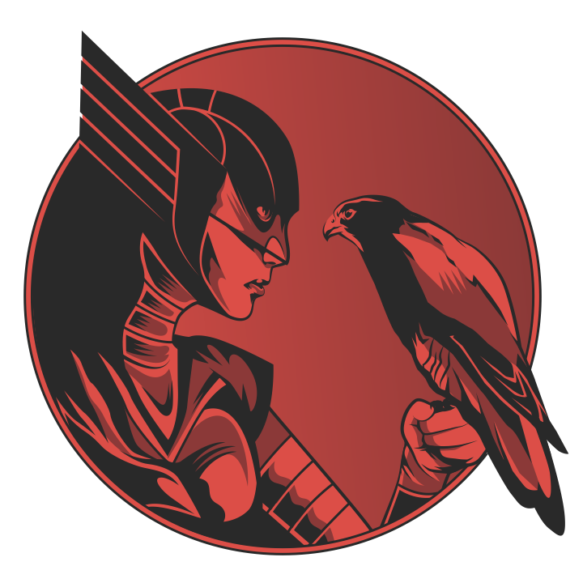

# FalconPy Project Authors
The FalconPy project exists to enhance developer interactions with the CrowdStrike Falcon API. Designed to be easy to integrate and use within your Python projects, the library is released under the [Unlicense](LICENSE) license. Developed and maintained by a passionate group of security architects and specialists, FalconPy has received multiple contributions from the community at large.

| Name | |
| :--- | :--- |
| Joshua Hiller, `@jshcodes` | Lord of the FalconPys 🪰 |
| Dixon Styres, `@crowdstrikedcs` | Author |
| Devin Cargill, `@dcargs` | Author |

 

## Maintainers
The following contributors have demonstrated their passion for the FalconPy project by going above and beyond to assist with the maintainence of this repository.

| Name | Role |
| :--- | :--- |
| Šimon Lukašík, `@isimluk` | [Sanity Checker](https://xkcd.com/1926/) |
| Josh Lang, `@jlangdev` | [Lint Purveyor](https://xkcd.com/1833/) |
| Gabe Alford, `@redhatrises` | [Git Whisperer](https://xkcd.com/1597/) |
| Christophe Viaud, `@falcon-pioupiou` | Maintainer |
| Shane Shellenbarger, `@soggysec` | Maintainer |

## Contributors
The following members of the community have made requests, suggestions, code contributions or provided feedback and reported bugs.
This has been a critical element in the development of the FalconPy project.

+ Justin Harris, `@jhseceng`
+ Bryan McClellan, `@mccbryan3`
+ Caleb Schwartz, `@rewgord`
+ Brendan Kremian, `@bk-cs`
+ `@modubyk`
+ James Hodgkinson, `@yaleman`
+ `@matcha-shake`
+ `@nighttardis`
+ Andrew, `@aneisch`
+ Sean Whalen, `@cah-sean-whalen`
+ `@woodtechie1428`
+ `@sshahar`
+ Chris S, `@EdgeSync`
+ Alexandre Borgo, `@alexandreborgo`
+ Kyle Cozad, `@cozadk`
+ `@sspencer-hubble`
+ Timothy Sullivan, `@tsullivan06`
+ `@t-lark`
+ Steve Klassen, `@mrxinu`
+ Valerian Rossigneux, `@valerianrossigneux`
+ Kenny Mancuso, `@KennyOps`
+ `@morcef`
+ Andrew Harris, `@ciberesponce`
+ `@philldtaylor`

## Sponsors
Without the support of these executives, the FalconPy project would not have happened.

| Name | Role |
| :-- | :-- |
| Chris Kachigian, `@ckachigian` | Herder of Cats |
| Rekha Das | Gatekeeper |
| Robbie Coleman, `@erraggy` | Keymaster |
| Mike Cryer | Colonel-in-Chief |

#### Honorable mentions
+ Jaime Franklin
+ Shawn Wells, `@shawndwells`

# Want to see your name on this list?
Interested in joining an elite community of security-focused Python developers? 

_**Excellent**_, we want your contributions! 

### Start [here](https://github.com/CrowdStrike/falconpy/blob/main/CONTRIBUTING.md).
