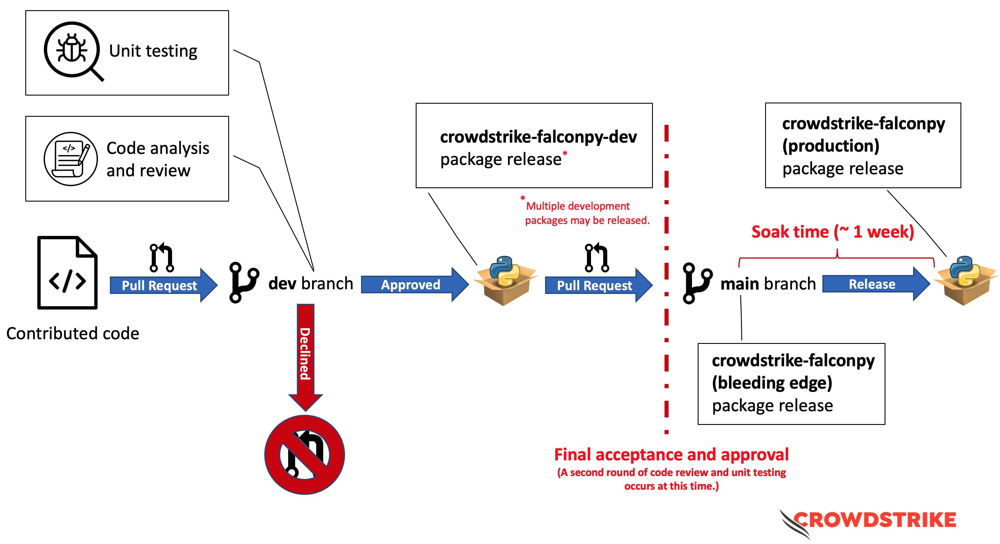

# FalconPy package release cycle

There are two Python packages for the CrowdStrike FalconPy project, [__development__](https://pypi.org/project/crowdstrike-falconpy-dev/)
and [__production__](https://pypi.org/project/crowdstrike-falconpy/).

These packages are released on a regular cadence based upon the [code review](https://github.com/CrowdStrike/falconpy/blob/main/CONTRIBUTING.md#code-quality-and-style-linting) and [testing](https://github.com/CrowdStrike/falconpy/blob/main/CONTRIBUTING.md#unit-testing-and-code-coverage) cycle currently in place for this repository.

* [Process overview](#process-overview)
* [Development Package (__crowdstrike-falconpy-dev__)](#development-package-crowdstrike-falconpy-dev)
* [Production Package (__crowdstrike-falconpy__)](#production-package-crowdstrike-falconpy)
* [Questions and Feedback](#questions-and-feedback)

## Process overview

## Development Package (__crowdstrike-falconpy-dev__)
The development package for FalconPy is released from the [__dev__](https://github.com/CrowdStrike/falconpy/tree/dev) branch as part of the [code review](https://github.com/CrowdStrike/falconpy/blob/main/CONTRIBUTING.md#code-quality-and-style-linting) and [testing](https://github.com/CrowdStrike/falconpy/blob/main/CONTRIBUTING.md#unit-testing-and-code-coverage) process. Depending on the nature of the changes undergoing testing, there may be several development packages released.

> The module name for the `crowdstrike-falconpy-dev` package is `falconpydev`.
>
> Example: `from falconpydev import Hosts`

These packages will loosely follow the [Semantic Versioning Specification](https://semver.org) (SemVer) for specifying versions,
with the final release aligning to the version for the next release of the production package.

> Due to [differences](https://github.com/semver/semver/issues/483) between [SemVer](https://semver.org) and [PEP 440](https://www.python.org/dev/peps/pep-0440/), pre-release version numbers will not be SemVer compliant.

### Example
| Package | Version number |
| :-- | :-- |
| Current production version | __1.0.1__ |
|Development package 1 (pre-release) | __1.0.2.dev1__ |
|Development package 2 (pre-release) | __1.0.2.dev2__ |
|Development package (release) | __1.0.2__ |

A bleeding edge / development build announcement is posted to the [Show and Tell section](https://github.com/CrowdStrike/falconpy/discussions/categories/show-and-tell) of the discussion board for each published release of a final development package build.

### Development Package bleeding edge releases
Similar to the production package, there are _bleeding edge_ releases for the development package. Typically these
are used to confirm package integrity and are deployed immediately before a development release. Bleeding edge packages
are published to the [__test__ PyPI package index](https://test.pypi.org). Developers are welcome to test using the development
bleeding edge release, but it is not recommended. The publishing of these packages will be followed up almost immediately by a
package deployment to the [__production__ PyPI package index](https://pypi.org).

> Please note: Bleeding edge packages published to the [__test__ PyPI package index](https://test.pypi.org) are periodically deleted en masse.

## Production Package (__crowdstrike-falconpy__)
After a second round of [code review](https://github.com/CrowdStrike/falconpy/blob/main/CONTRIBUTING.md#code-quality-and-style-linting) and [testing](https://github.com/CrowdStrike/falconpy/blob/main/CONTRIBUTING.md#unit-testing-and-code-coverage) has successfully been completed, updates are merged to the [__main__](https://github.com/CrowdStrike/falconpy/tree/main) branch of this repository. Shortly afterwards, a _bleeding edge_ package will be released to the [__test__ PyPI package index](https://test.pypi.org). Developers are encouraged to leverage the _bleeding edge_ build to perform local testing before upgrading to the latest version. After a period of time used for soak and acceptance testing (specified in the development build announcement), the production package for FalconPy is released to the [__production__ PyPI package index](https://pypi.org). All production versions of FalconPy strictly follow [SemVer](https://semver.org) for version specification.

A release announcement is posted to the [Show and Tell section](https://github.com/CrowdStrike/falconpy/discussions/categories/show-and-tell)
of the discussion board after every release of a production package.

## Questions and feedback
If you have [questions](https://github.com/CrowdStrike/falconpy/discussions/categories/q-a) or [suggestions for improving this process](https://github.com/CrowdStrike/falconpy/discussions/categories/ideas), please let us know by posting a message to our [discussion board](https://github.com/CrowdStrike/falconpy/discussions).

---

 

<h3>
WE STOP BREACHES
</h3>
