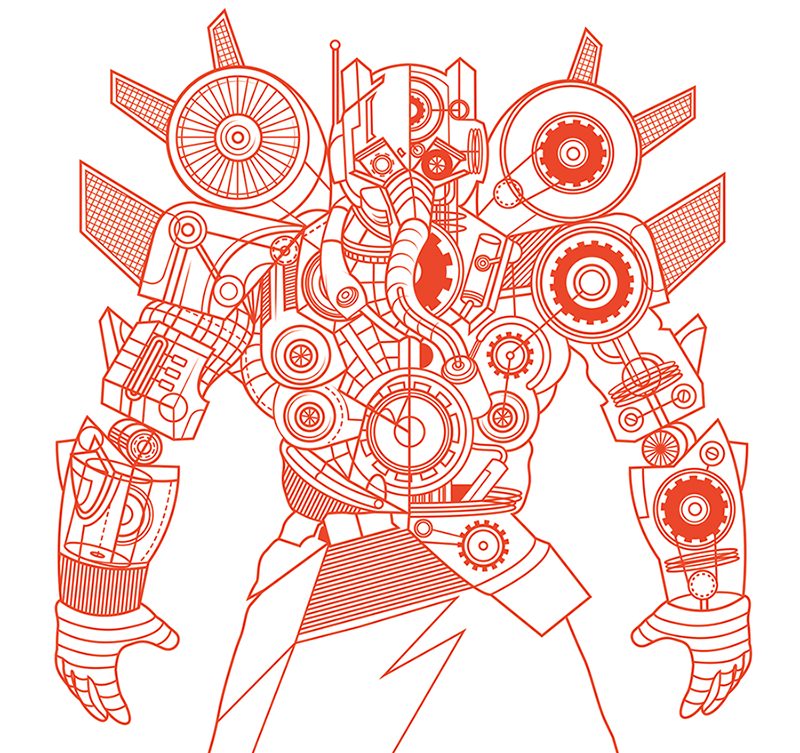

 

# FalconPy Sample Library

<!---->

These examples are provided as a quick start for your project.

+ [Authentication for Examples](#authentication-for-these-examples)
+ [Samples by API service collection](#samples-by-api-service-collection)
+ [Suggestions](#suggestions)

## Authentication for these Examples
In order to expedite sample delivery, examples will following one of three standard patterns for defining and providing credentials for API access. 

| Pattern | Usage detail |
| :--- | :--- |
| Environment variables | Credentials are retrieved from the local environment of the machine the example is executed on.  These values are named:<ul><li>`FALCON_CLIENT_ID`</li><li>`FALCON_CLIENT_SECRET`</li></ul> |
| Runtime (Command line arguments) | Credentials are consumed at runtime via command line parameters. Typically this handled via the [`argparse`](https://docs.python.org/3/library/argparse.html) module. |
| Standardized "credential" file | This file is named `config.json`, and is in JSON format. A sample of this file, [`config_sample.json`](config_sample.json) is provided within this folder. Rename this file to `config.json`, and then update it's contents to reflect your current development API credentials.  |

> Please note: These are not the only methods for providing these values. The file `config.json` is __not encrypted__ and may not be suitable for production deployments.

## Samples by API service collection
These following samples are categorized by API service collection.

- [Event Streams](#event-streams)
- [Falcon Discover](#falcon-discover)
- [Falcon Horizon](#falcon-horizon)
- [Falcon Flight Control](#falcon-flight-control)
- [Falcon X Sandbox](#falcon-x-sandbox)
- [Hosts](#hosts)
- [IOC](#ioc)
- [MalQuery](#malquery)
- [Quick Scan / Sample Uploads](#quick-scan--sample-uploads)
- [Real Time Response](#real-time-response)
- [Sample Uploads](#sample-uploads)
- [Sensor Download](#sensor-download)
- [Spotlight Vulnerabilities](#spotlight-vulnerabilities)

### Class type legend
Provided examples are further categorized by the type of class used to interact with the CrowdStrike API.

| Indicator | Detail |
| :--- | :--- |
| [![Service Class](https://img.shields.io/badge/-Service%20Class-red?style=for-the-badge&logo=data:image/png;base64,iVBORw0KGgoAAAANSUhEUgAAABIAAAAOCAYAAAAi2ky3AAABhWlDQ1BJQ0MgcHJvZmlsZQAAKJF9kT1Iw1AUhU9TpaIVBzuIOGSoDmJBVEQ3rUIRKoRaoVUHk5f+CE0akhQXR8G14ODPYtXBxVlXB1dBEPwBcXNzUnSREu9LCi1ifPB4H+e9c7jvXkColZhmtY0Cmm6bqURczGRXxNAruhAEMI1hmVnGrCQl4bu+7hHg512MZ/m/+3N1qzmLAQGReIYZpk28Tjy5aRuc94kjrCirxOfEIyYVSPzIdcXjN84FlwWeGTHTqTniCLFYaGGlhVnR1IgniKOqplO+kPFY5bzFWStVWKNO/sNwTl9e4jrtASSwgEVIEKGggg2UYCNGp06KhRTdx338/a5fIpdCrg0wcsyjDA2y6wefwe/eWvnxMS8pHAfaXxznYxAI7QL1quN8HztO/QQIPgNXetNfrgFTn6RXm1r0COjZBi6um5qyB1zuAH1PhmzKrsTnL+TzwPsZjSkL9N4Cnate3xr3OH0A0tSr5A1wcAgMFSh7zeffHa19+/dNo38/hq9yr+iELI0AAAAGYktHRAAAAAAAAPlDu38AAAAJcEhZcwAACxMAAAsTAQCanBgAAAAHdElNRQflDAsTByz7Va2cAAAAGXRFWHRDb21tZW50AENyZWF0ZWQgd2l0aCBHSU1QV4EOFwAAAYBJREFUKM+lkjFIlVEYht/zn3sFkYYUyUnIRcemhCtCU6JQOLiIU+QeJEQg6BBIm0s4RBCBLjq5OEvgJC1uOniJhivesLx17/97/vO9b4NK4g25157hfHCGB773/cA0HZIEAKiMj+LWiOxljG/i96pnCFP58XHnrWX2+9cj0dYl9Yu2FE9/9rXrcAAgs2eSyiBfOe/XRD503h/CuffOubQVUXL+Jh9BllzBbyJJBgDclVkO4Kukd8zzkXJbeUljIldFTstsmSHM6S81ma2KfPKlFdkGAMY4wzx/bbXapMy21My+YizdKNq5mDzLkrxafSxySFKjSWX2oTmjKzz4vN0r2lOFcL/Q3V0/mX95ILMXTTGYVfaut/aP2+oCMAvnZgCcsF5fcR0dg65YHAdwB+QApADvu0AuOe/ftlJAD7Nsgmm6yBjDtfWORJZlNtFyo/lR5Z7MyheKA5ktSur7sTAHazSG27pehjAiaVfkN8b4XFIJ/wOzbOx07VNRUuHy7w98CzCcGPyWywAAAABJRU5ErkJggg==)](https://www.falconpy.io/Usage/Basic-Service-Class-usage.html) | These samples leverage Service Classes to accomplish the example task. |
| [![Uber Class](https://img.shields.io/badge/-Uber%20Class-maroon?style=for-the-badge&logo=data:image/png;base64,iVBORw0KGgoAAAANSUhEUgAAABIAAAAOCAYAAAAi2ky3AAABhWlDQ1BJQ0MgcHJvZmlsZQAAKJF9kT1Iw1AUhU9TpaIVBzuIOGSoDmJBVEQ3rUIRKoRaoVUHk5f+CE0akhQXR8G14ODPYtXBxVlXB1dBEPwBcXNzUnSREu9LCi1ifPB4H+e9c7jvXkColZhmtY0Cmm6bqURczGRXxNAruhAEMI1hmVnGrCQl4bu+7hHg512MZ/m/+3N1qzmLAQGReIYZpk28Tjy5aRuc94kjrCirxOfEIyYVSPzIdcXjN84FlwWeGTHTqTniCLFYaGGlhVnR1IgniKOqplO+kPFY5bzFWStVWKNO/sNwTl9e4jrtASSwgEVIEKGggg2UYCNGp06KhRTdx338/a5fIpdCrg0wcsyjDA2y6wefwe/eWvnxMS8pHAfaXxznYxAI7QL1quN8HztO/QQIPgNXetNfrgFTn6RXm1r0COjZBi6um5qyB1zuAH1PhmzKrsTnL+TzwPsZjSkL9N4Cnate3xr3OH0A0tSr5A1wcAgMFSh7zeffHa19+/dNo38/hq9yr+iELI0AAAAGYktHRAAAAAAAAPlDu38AAAAJcEhZcwAACxMAAAsTAQCanBgAAAAHdElNRQflDAsTByz7Va2cAAAAGXRFWHRDb21tZW50AENyZWF0ZWQgd2l0aCBHSU1QV4EOFwAAAYBJREFUKM+lkjFIlVEYht/zn3sFkYYUyUnIRcemhCtCU6JQOLiIU+QeJEQg6BBIm0s4RBCBLjq5OEvgJC1uOniJhivesLx17/97/vO9b4NK4g25157hfHCGB773/cA0HZIEAKiMj+LWiOxljG/i96pnCFP58XHnrWX2+9cj0dYl9Yu2FE9/9rXrcAAgs2eSyiBfOe/XRD503h/CuffOubQVUXL+Jh9BllzBbyJJBgDclVkO4Kukd8zzkXJbeUljIldFTstsmSHM6S81ma2KfPKlFdkGAMY4wzx/bbXapMy21My+YizdKNq5mDzLkrxafSxySFKjSWX2oTmjKzz4vN0r2lOFcL/Q3V0/mX95ILMXTTGYVfaut/aP2+oCMAvnZgCcsF5fcR0dg65YHAdwB+QApADvu0AuOe/ftlJAD7Nsgmm6yBjDtfWORJZlNtFyo/lR5Z7MyheKA5ktSur7sTAHazSG27pehjAiaVfkN8b4XFIJ/wOzbOx07VNRUuHy7w98CzCcGPyWywAAAABJRU5ErkJggg==)](https://www.falconpy.io/Usage/Basic-Uber-Class-usage.html) | These samples make use of the Uber Class to perform the example task. |

### Event Streams
This example demonstrates publishing AWS Security Hub findings from CrowdStrike Falcon Event Streams API.

[![Event Streams](https://img.shields.io/badge/Uber%20Class-Send%20Detections%20to%20AWS%20Security%20Hub-silver?style=for-the-badge&labelColor=maroon&logo=data:image/png;base64,iVBORw0KGgoAAAANSUhEUgAAABIAAAAOCAYAAAAi2ky3AAABhWlDQ1BJQ0MgcHJvZmlsZQAAKJF9kT1Iw1AUhU9TpaIVBzuIOGSoDmJBVEQ3rUIRKoRaoVUHk5f+CE0akhQXR8G14ODPYtXBxVlXB1dBEPwBcXNzUnSREu9LCi1ifPB4H+e9c7jvXkColZhmtY0Cmm6bqURczGRXxNAruhAEMI1hmVnGrCQl4bu+7hHg512MZ/m/+3N1qzmLAQGReIYZpk28Tjy5aRuc94kjrCirxOfEIyYVSPzIdcXjN84FlwWeGTHTqTniCLFYaGGlhVnR1IgniKOqplO+kPFY5bzFWStVWKNO/sNwTl9e4jrtASSwgEVIEKGggg2UYCNGp06KhRTdx338/a5fIpdCrg0wcsyjDA2y6wefwe/eWvnxMS8pHAfaXxznYxAI7QL1quN8HztO/QQIPgNXetNfrgFTn6RXm1r0COjZBi6um5qyB1zuAH1PhmzKrsTnL+TzwPsZjSkL9N4Cnate3xr3OH0A0tSr5A1wcAgMFSh7zeffHa19+/dNo38/hq9yr+iELI0AAAAGYktHRAAAAAAAAPlDu38AAAAJcEhZcwAACxMAAAsTAQCanBgAAAAHdElNRQflDAsTByz7Va2cAAAAGXRFWHRDb21tZW50AENyZWF0ZWQgd2l0aCBHSU1QV4EOFwAAAYBJREFUKM+lkjFIlVEYht/zn3sFkYYUyUnIRcemhCtCU6JQOLiIU+QeJEQg6BBIm0s4RBCBLjq5OEvgJC1uOniJhivesLx17/97/vO9b4NK4g25157hfHCGB773/cA0HZIEAKiMj+LWiOxljG/i96pnCFP58XHnrWX2+9cj0dYl9Yu2FE9/9rXrcAAgs2eSyiBfOe/XRD503h/CuffOubQVUXL+Jh9BllzBbyJJBgDclVkO4Kukd8zzkXJbeUljIldFTstsmSHM6S81ma2KfPKlFdkGAMY4wzx/bbXapMy21My+YizdKNq5mDzLkrxafSxySFKjSWX2oTmjKzz4vN0r2lOFcL/Q3V0/mX95ILMXTTGYVfaut/aP2+oCMAvnZgCcsF5fcR0dg65YHAdwB+QApADvu0AuOe/ftlJAD7Nsgmm6yBjDtfWORJZlNtFyo/lR5Z7MyheKA5ktSur7sTAHazSG27pehjAiaVfkN8b4XFIJ/wOzbOx07VNRUuHy7w98CzCcGPyWywAAAABJRU5ErkJggg==)](https://github.com/CrowdStrike/Cloud-AWS/tree/main/Security-Hub)

### Falcon Discover for Cloud and Containers (AWS Accounts)
This example demonstrates using FalconPy to manage accounts managed by CrowdStrike Falcon Discover for Cloud (AWS).

[![Falcon Discover for Cloud (AWS)](https://img.shields.io/badge/Service%20Class-Manage%20Discover%20Accounts-silver?style=for-the-badge&labelColor=red&logo=data:image/png;base64,iVBORw0KGgoAAAANSUhEUgAAABIAAAAOCAYAAAAi2ky3AAABhWlDQ1BJQ0MgcHJvZmlsZQAAKJF9kT1Iw1AUhU9TpaIVBzuIOGSoDmJBVEQ3rUIRKoRaoVUHk5f+CE0akhQXR8G14ODPYtXBxVlXB1dBEPwBcXNzUnSREu9LCi1ifPB4H+e9c7jvXkColZhmtY0Cmm6bqURczGRXxNAruhAEMI1hmVnGrCQl4bu+7hHg512MZ/m/+3N1qzmLAQGReIYZpk28Tjy5aRuc94kjrCirxOfEIyYVSPzIdcXjN84FlwWeGTHTqTniCLFYaGGlhVnR1IgniKOqplO+kPFY5bzFWStVWKNO/sNwTl9e4jrtASSwgEVIEKGggg2UYCNGp06KhRTdx338/a5fIpdCrg0wcsyjDA2y6wefwe/eWvnxMS8pHAfaXxznYxAI7QL1quN8HztO/QQIPgNXetNfrgFTn6RXm1r0COjZBi6um5qyB1zuAH1PhmzKrsTnL+TzwPsZjSkL9N4Cnate3xr3OH0A0tSr5A1wcAgMFSh7zeffHa19+/dNo38/hq9yr+iELI0AAAAGYktHRAAAAAAAAPlDu38AAAAJcEhZcwAACxMAAAsTAQCanBgAAAAHdElNRQflDAsTByz7Va2cAAAAGXRFWHRDb21tZW50AENyZWF0ZWQgd2l0aCBHSU1QV4EOFwAAAYBJREFUKM+lkjFIlVEYht/zn3sFkYYUyUnIRcemhCtCU6JQOLiIU+QeJEQg6BBIm0s4RBCBLjq5OEvgJC1uOniJhivesLx17/97/vO9b4NK4g25157hfHCGB773/cA0HZIEAKiMj+LWiOxljG/i96pnCFP58XHnrWX2+9cj0dYl9Yu2FE9/9rXrcAAgs2eSyiBfOe/XRD503h/CuffOubQVUXL+Jh9BllzBbyJJBgDclVkO4Kukd8zzkXJbeUljIldFTstsmSHM6S81ma2KfPKlFdkGAMY4wzx/bbXapMy21My+YizdKNq5mDzLkrxafSxySFKjSWX2oTmjKzz4vN0r2lOFcL/Q3V0/mX95ILMXTTGYVfaut/aP2+oCMAvnZgCcsF5fcR0dg65YHAdwB+QApADvu0AuOe/ftlJAD7Nsgmm6yBjDtfWORJZlNtFyo/lR5Z7MyheKA5ktSur7sTAHazSG27pehjAiaVfkN8b4XFIJ/wOzbOx07VNRUuHy7w98CzCcGPyWywAAAABJRU5ErkJggg==)](discover_aws/manage_discover_accounts_service.py) 
[![Falcon Discover for Cloud (AWS)](https://img.shields.io/badge/Uber%20Class-Manage%20Discover%20Accounts-silver?style=for-the-badge&labelColor=maroon&logo=data:image/png;base64,iVBORw0KGgoAAAANSUhEUgAAABIAAAAOCAYAAAAi2ky3AAABhWlDQ1BJQ0MgcHJvZmlsZQAAKJF9kT1Iw1AUhU9TpaIVBzuIOGSoDmJBVEQ3rUIRKoRaoVUHk5f+CE0akhQXR8G14ODPYtXBxVlXB1dBEPwBcXNzUnSREu9LCi1ifPB4H+e9c7jvXkColZhmtY0Cmm6bqURczGRXxNAruhAEMI1hmVnGrCQl4bu+7hHg512MZ/m/+3N1qzmLAQGReIYZpk28Tjy5aRuc94kjrCirxOfEIyYVSPzIdcXjN84FlwWeGTHTqTniCLFYaGGlhVnR1IgniKOqplO+kPFY5bzFWStVWKNO/sNwTl9e4jrtASSwgEVIEKGggg2UYCNGp06KhRTdx338/a5fIpdCrg0wcsyjDA2y6wefwe/eWvnxMS8pHAfaXxznYxAI7QL1quN8HztO/QQIPgNXetNfrgFTn6RXm1r0COjZBi6um5qyB1zuAH1PhmzKrsTnL+TzwPsZjSkL9N4Cnate3xr3OH0A0tSr5A1wcAgMFSh7zeffHa19+/dNo38/hq9yr+iELI0AAAAGYktHRAAAAAAAAPlDu38AAAAJcEhZcwAACxMAAAsTAQCanBgAAAAHdElNRQflDAsTByz7Va2cAAAAGXRFWHRDb21tZW50AENyZWF0ZWQgd2l0aCBHSU1QV4EOFwAAAYBJREFUKM+lkjFIlVEYht/zn3sFkYYUyUnIRcemhCtCU6JQOLiIU+QeJEQg6BBIm0s4RBCBLjq5OEvgJC1uOniJhivesLx17/97/vO9b4NK4g25157hfHCGB773/cA0HZIEAKiMj+LWiOxljG/i96pnCFP58XHnrWX2+9cj0dYl9Yu2FE9/9rXrcAAgs2eSyiBfOe/XRD503h/CuffOubQVUXL+Jh9BllzBbyJJBgDclVkO4Kukd8zzkXJbeUljIldFTstsmSHM6S81ma2KfPKlFdkGAMY4wzx/bbXapMy21My+YizdKNq5mDzLkrxafSxySFKjSWX2oTmjKzz4vN0r2lOFcL/Q3V0/mX95ILMXTTGYVfaut/aP2+oCMAvnZgCcsF5fcR0dg65YHAdwB+QApADvu0AuOe/ftlJAD7Nsgmm6yBjDtfWORJZlNtFyo/lR5Z7MyheKA5ktSur7sTAHazSG27pehjAiaVfkN8b4XFIJ/wOzbOx07VNRUuHy7w98CzCcGPyWywAAAABJRU5ErkJggg==)](discover_aws/manage_discover_accounts_uber.py)

### Falcon Horizon
Use FalconPy to report or export as CSV, all or selective CSP Falcon CSPM Policies with this example.

[![Falcon Horizon](https://img.shields.io/badge/Service%20Class-Report%20Horizon%20Policies-silver?style=for-the-badge&labelColor=red&logo=data:image/png;base64,iVBORw0KGgoAAAANSUhEUgAAABIAAAAOCAYAAAAi2ky3AAABhWlDQ1BJQ0MgcHJvZmlsZQAAKJF9kT1Iw1AUhU9TpaIVBzuIOGSoDmJBVEQ3rUIRKoRaoVUHk5f+CE0akhQXR8G14ODPYtXBxVlXB1dBEPwBcXNzUnSREu9LCi1ifPB4H+e9c7jvXkColZhmtY0Cmm6bqURczGRXxNAruhAEMI1hmVnGrCQl4bu+7hHg512MZ/m/+3N1qzmLAQGReIYZpk28Tjy5aRuc94kjrCirxOfEIyYVSPzIdcXjN84FlwWeGTHTqTniCLFYaGGlhVnR1IgniKOqplO+kPFY5bzFWStVWKNO/sNwTl9e4jrtASSwgEVIEKGggg2UYCNGp06KhRTdx338/a5fIpdCrg0wcsyjDA2y6wefwe/eWvnxMS8pHAfaXxznYxAI7QL1quN8HztO/QQIPgNXetNfrgFTn6RXm1r0COjZBi6um5qyB1zuAH1PhmzKrsTnL+TzwPsZjSkL9N4Cnate3xr3OH0A0tSr5A1wcAgMFSh7zeffHa19+/dNo38/hq9yr+iELI0AAAAGYktHRAAAAAAAAPlDu38AAAAJcEhZcwAACxMAAAsTAQCanBgAAAAHdElNRQflDAsTByz7Va2cAAAAGXRFWHRDb21tZW50AENyZWF0ZWQgd2l0aCBHSU1QV4EOFwAAAYBJREFUKM+lkjFIlVEYht/zn3sFkYYUyUnIRcemhCtCU6JQOLiIU+QeJEQg6BBIm0s4RBCBLjq5OEvgJC1uOniJhivesLx17/97/vO9b4NK4g25157hfHCGB773/cA0HZIEAKiMj+LWiOxljG/i96pnCFP58XHnrWX2+9cj0dYl9Yu2FE9/9rXrcAAgs2eSyiBfOe/XRD503h/CuffOubQVUXL+Jh9BllzBbyJJBgDclVkO4Kukd8zzkXJbeUljIldFTstsmSHM6S81ma2KfPKlFdkGAMY4wzx/bbXapMy21My+YizdKNq5mDzLkrxafSxySFKjSWX2oTmjKzz4vN0r2lOFcL/Q3V0/mX95ILMXTTGYVfaut/aP2+oCMAvnZgCcsF5fcR0dg65YHAdwB+QApADvu0AuOe/ftlJAD7Nsgmm6yBjDtfWORJZlNtFyo/lR5Z7MyheKA5ktSur7sTAHazSG27pehjAiaVfkN8b4XFIJ/wOzbOx07VNRUuHy7w98CzCcGPyWywAAAABJRU5ErkJggg==)](cspm_registration/get_cspm_policies.py) 

### Falcon Flight Control
This example demonstrates retrieving a child CID using the CrowdStrike Falcon Flight Control API.

[![Falcon Flight Control](https://img.shields.io/badge/Service%20Class-Find%20Child%20CID-silver?style=for-the-badge&labelColor=red&logo=data:image/png;base64,iVBORw0KGgoAAAANSUhEUgAAABIAAAAOCAYAAAAi2ky3AAABhWlDQ1BJQ0MgcHJvZmlsZQAAKJF9kT1Iw1AUhU9TpaIVBzuIOGSoDmJBVEQ3rUIRKoRaoVUHk5f+CE0akhQXR8G14ODPYtXBxVlXB1dBEPwBcXNzUnSREu9LCi1ifPB4H+e9c7jvXkColZhmtY0Cmm6bqURczGRXxNAruhAEMI1hmVnGrCQl4bu+7hHg512MZ/m/+3N1qzmLAQGReIYZpk28Tjy5aRuc94kjrCirxOfEIyYVSPzIdcXjN84FlwWeGTHTqTniCLFYaGGlhVnR1IgniKOqplO+kPFY5bzFWStVWKNO/sNwTl9e4jrtASSwgEVIEKGggg2UYCNGp06KhRTdx338/a5fIpdCrg0wcsyjDA2y6wefwe/eWvnxMS8pHAfaXxznYxAI7QL1quN8HztO/QQIPgNXetNfrgFTn6RXm1r0COjZBi6um5qyB1zuAH1PhmzKrsTnL+TzwPsZjSkL9N4Cnate3xr3OH0A0tSr5A1wcAgMFSh7zeffHa19+/dNo38/hq9yr+iELI0AAAAGYktHRAAAAAAAAPlDu38AAAAJcEhZcwAACxMAAAsTAQCanBgAAAAHdElNRQflDAsTByz7Va2cAAAAGXRFWHRDb21tZW50AENyZWF0ZWQgd2l0aCBHSU1QV4EOFwAAAYBJREFUKM+lkjFIlVEYht/zn3sFkYYUyUnIRcemhCtCU6JQOLiIU+QeJEQg6BBIm0s4RBCBLjq5OEvgJC1uOniJhivesLx17/97/vO9b4NK4g25157hfHCGB773/cA0HZIEAKiMj+LWiOxljG/i96pnCFP58XHnrWX2+9cj0dYl9Yu2FE9/9rXrcAAgs2eSyiBfOe/XRD503h/CuffOubQVUXL+Jh9BllzBbyJJBgDclVkO4Kukd8zzkXJbeUljIldFTstsmSHM6S81ma2KfPKlFdkGAMY4wzx/bbXapMy21My+YizdKNq5mDzLkrxafSxySFKjSWX2oTmjKzz4vN0r2lOFcL/Q3V0/mX95ILMXTTGYVfaut/aP2+oCMAvnZgCcsF5fcR0dg65YHAdwB+QApADvu0AuOe/ftlJAD7Nsgmm6yBjDtfWORJZlNtFyo/lR5Z7MyheKA5ktSur7sTAHazSG27pehjAiaVfkN8b4XFIJ/wOzbOx07VNRUuHy7w98CzCcGPyWywAAAABJRU5ErkJggg==)](flight_control/find_child_cid.py) 

### Falcon X Sandbox
Analyze a single file for malware with this example.

[![Falcon X Sandbox](https://img.shields.io/badge/Service%20Class-Analyze%20a%20Single%20file-silver?style=for-the-badge&labelColor=red&logo=data:image/png;base64,iVBORw0KGgoAAAANSUhEUgAAABIAAAAOCAYAAAAi2ky3AAABhWlDQ1BJQ0MgcHJvZmlsZQAAKJF9kT1Iw1AUhU9TpaIVBzuIOGSoDmJBVEQ3rUIRKoRaoVUHk5f+CE0akhQXR8G14ODPYtXBxVlXB1dBEPwBcXNzUnSREu9LCi1ifPB4H+e9c7jvXkColZhmtY0Cmm6bqURczGRXxNAruhAEMI1hmVnGrCQl4bu+7hHg512MZ/m/+3N1qzmLAQGReIYZpk28Tjy5aRuc94kjrCirxOfEIyYVSPzIdcXjN84FlwWeGTHTqTniCLFYaGGlhVnR1IgniKOqplO+kPFY5bzFWStVWKNO/sNwTl9e4jrtASSwgEVIEKGggg2UYCNGp06KhRTdx338/a5fIpdCrg0wcsyjDA2y6wefwe/eWvnxMS8pHAfaXxznYxAI7QL1quN8HztO/QQIPgNXetNfrgFTn6RXm1r0COjZBi6um5qyB1zuAH1PhmzKrsTnL+TzwPsZjSkL9N4Cnate3xr3OH0A0tSr5A1wcAgMFSh7zeffHa19+/dNo38/hq9yr+iELI0AAAAGYktHRAAAAAAAAPlDu38AAAAJcEhZcwAACxMAAAsTAQCanBgAAAAHdElNRQflDAsTByz7Va2cAAAAGXRFWHRDb21tZW50AENyZWF0ZWQgd2l0aCBHSU1QV4EOFwAAAYBJREFUKM+lkjFIlVEYht/zn3sFkYYUyUnIRcemhCtCU6JQOLiIU+QeJEQg6BBIm0s4RBCBLjq5OEvgJC1uOniJhivesLx17/97/vO9b4NK4g25157hfHCGB773/cA0HZIEAKiMj+LWiOxljG/i96pnCFP58XHnrWX2+9cj0dYl9Yu2FE9/9rXrcAAgs2eSyiBfOe/XRD503h/CuffOubQVUXL+Jh9BllzBbyJJBgDclVkO4Kukd8zzkXJbeUljIldFTstsmSHM6S81ma2KfPKlFdkGAMY4wzx/bbXapMy21My+YizdKNq5mDzLkrxafSxySFKjSWX2oTmjKzz4vN0r2lOFcL/Q3V0/mX95ILMXTTGYVfaut/aP2+oCMAvnZgCcsF5fcR0dg65YHAdwB+QApADvu0AuOe/ftlJAD7Nsgmm6yBjDtfWORJZlNtFyo/lR5Z7MyheKA5ktSur7sTAHazSG27pehjAiaVfkN8b4XFIJ/wOzbOx07VNRUuHy7w98CzCcGPyWywAAAABJRU5ErkJggg==)](falconx_sandbox/single_scan) 
[![Falcon X Sandbox](https://img.shields.io/badge/Uber%20Class-Analyze%20a%20Single%20File-silver?style=for-the-badge&labelColor=maroon&logo=data:image/png;base64,iVBORw0KGgoAAAANSUhEUgAAABIAAAAOCAYAAAAi2ky3AAABhWlDQ1BJQ0MgcHJvZmlsZQAAKJF9kT1Iw1AUhU9TpaIVBzuIOGSoDmJBVEQ3rUIRKoRaoVUHk5f+CE0akhQXR8G14ODPYtXBxVlXB1dBEPwBcXNzUnSREu9LCi1ifPB4H+e9c7jvXkColZhmtY0Cmm6bqURczGRXxNAruhAEMI1hmVnGrCQl4bu+7hHg512MZ/m/+3N1qzmLAQGReIYZpk28Tjy5aRuc94kjrCirxOfEIyYVSPzIdcXjN84FlwWeGTHTqTniCLFYaGGlhVnR1IgniKOqplO+kPFY5bzFWStVWKNO/sNwTl9e4jrtASSwgEVIEKGggg2UYCNGp06KhRTdx338/a5fIpdCrg0wcsyjDA2y6wefwe/eWvnxMS8pHAfaXxznYxAI7QL1quN8HztO/QQIPgNXetNfrgFTn6RXm1r0COjZBi6um5qyB1zuAH1PhmzKrsTnL+TzwPsZjSkL9N4Cnate3xr3OH0A0tSr5A1wcAgMFSh7zeffHa19+/dNo38/hq9yr+iELI0AAAAGYktHRAAAAAAAAPlDu38AAAAJcEhZcwAACxMAAAsTAQCanBgAAAAHdElNRQflDAsTByz7Va2cAAAAGXRFWHRDb21tZW50AENyZWF0ZWQgd2l0aCBHSU1QV4EOFwAAAYBJREFUKM+lkjFIlVEYht/zn3sFkYYUyUnIRcemhCtCU6JQOLiIU+QeJEQg6BBIm0s4RBCBLjq5OEvgJC1uOniJhivesLx17/97/vO9b4NK4g25157hfHCGB773/cA0HZIEAKiMj+LWiOxljG/i96pnCFP58XHnrWX2+9cj0dYl9Yu2FE9/9rXrcAAgs2eSyiBfOe/XRD503h/CuffOubQVUXL+Jh9BllzBbyJJBgDclVkO4Kukd8zzkXJbeUljIldFTstsmSHM6S81ma2KfPKlFdkGAMY4wzx/bbXapMy21My+YizdKNq5mDzLkrxafSxySFKjSWX2oTmjKzz4vN0r2lOFcL/Q3V0/mX95ILMXTTGYVfaut/aP2+oCMAvnZgCcsF5fcR0dg65YHAdwB+QApADvu0AuOe/ftlJAD7Nsgmm6yBjDtfWORJZlNtFyo/lR5Z7MyheKA5ktSur7sTAHazSG27pehjAiaVfkN8b4XFIJ/wOzbOx07VNRUuHy7w98CzCcGPyWywAAAABJRU5ErkJggg==)](falconx_sandbox/single_scan)

This example demonstrates retrieving all artifacts for all reports (in all supported formats).

[![Falcon X Sandbox](https://img.shields.io/badge/Service%20Class-Get%20All%20Artifacts-silver?style=for-the-badge&labelColor=red&logo=data:image/png;base64,iVBORw0KGgoAAAANSUhEUgAAABIAAAAOCAYAAAAi2ky3AAABhWlDQ1BJQ0MgcHJvZmlsZQAAKJF9kT1Iw1AUhU9TpaIVBzuIOGSoDmJBVEQ3rUIRKoRaoVUHk5f+CE0akhQXR8G14ODPYtXBxVlXB1dBEPwBcXNzUnSREu9LCi1ifPB4H+e9c7jvXkColZhmtY0Cmm6bqURczGRXxNAruhAEMI1hmVnGrCQl4bu+7hHg512MZ/m/+3N1qzmLAQGReIYZpk28Tjy5aRuc94kjrCirxOfEIyYVSPzIdcXjN84FlwWeGTHTqTniCLFYaGGlhVnR1IgniKOqplO+kPFY5bzFWStVWKNO/sNwTl9e4jrtASSwgEVIEKGggg2UYCNGp06KhRTdx338/a5fIpdCrg0wcsyjDA2y6wefwe/eWvnxMS8pHAfaXxznYxAI7QL1quN8HztO/QQIPgNXetNfrgFTn6RXm1r0COjZBi6um5qyB1zuAH1PhmzKrsTnL+TzwPsZjSkL9N4Cnate3xr3OH0A0tSr5A1wcAgMFSh7zeffHa19+/dNo38/hq9yr+iELI0AAAAGYktHRAAAAAAAAPlDu38AAAAJcEhZcwAACxMAAAsTAQCanBgAAAAHdElNRQflDAsTByz7Va2cAAAAGXRFWHRDb21tZW50AENyZWF0ZWQgd2l0aCBHSU1QV4EOFwAAAYBJREFUKM+lkjFIlVEYht/zn3sFkYYUyUnIRcemhCtCU6JQOLiIU+QeJEQg6BBIm0s4RBCBLjq5OEvgJC1uOniJhivesLx17/97/vO9b4NK4g25157hfHCGB773/cA0HZIEAKiMj+LWiOxljG/i96pnCFP58XHnrWX2+9cj0dYl9Yu2FE9/9rXrcAAgs2eSyiBfOe/XRD503h/CuffOubQVUXL+Jh9BllzBbyJJBgDclVkO4Kukd8zzkXJbeUljIldFTstsmSHM6S81ma2KfPKlFdkGAMY4wzx/bbXapMy21My+YizdKNq5mDzLkrxafSxySFKjSWX2oTmjKzz4vN0r2lOFcL/Q3V0/mX95ILMXTTGYVfaut/aP2+oCMAvnZgCcsF5fcR0dg65YHAdwB+QApADvu0AuOe/ftlJAD7Nsgmm6yBjDtfWORJZlNtFyo/lR5Z7MyheKA5ktSur7sTAHazSG27pehjAiaVfkN8b4XFIJ/wOzbOx07VNRUuHy7w98CzCcGPyWywAAAABJRU5ErkJggg==)](falconx_sandbox/get_all_artifacts.py) 

### Hosts
This example will demonstrate how to retrieve a list of sensors by hostname.

[![Hosts](https://img.shields.io/badge/Service%20Class-List%20Sensors%20By%20Hostname-silver?style=for-the-badge&labelColor=red&logo=data:image/png;base64,iVBORw0KGgoAAAANSUhEUgAAABIAAAAOCAYAAAAi2ky3AAABhWlDQ1BJQ0MgcHJvZmlsZQAAKJF9kT1Iw1AUhU9TpaIVBzuIOGSoDmJBVEQ3rUIRKoRaoVUHk5f+CE0akhQXR8G14ODPYtXBxVlXB1dBEPwBcXNzUnSREu9LCi1ifPB4H+e9c7jvXkColZhmtY0Cmm6bqURczGRXxNAruhAEMI1hmVnGrCQl4bu+7hHg512MZ/m/+3N1qzmLAQGReIYZpk28Tjy5aRuc94kjrCirxOfEIyYVSPzIdcXjN84FlwWeGTHTqTniCLFYaGGlhVnR1IgniKOqplO+kPFY5bzFWStVWKNO/sNwTl9e4jrtASSwgEVIEKGggg2UYCNGp06KhRTdx338/a5fIpdCrg0wcsyjDA2y6wefwe/eWvnxMS8pHAfaXxznYxAI7QL1quN8HztO/QQIPgNXetNfrgFTn6RXm1r0COjZBi6um5qyB1zuAH1PhmzKrsTnL+TzwPsZjSkL9N4Cnate3xr3OH0A0tSr5A1wcAgMFSh7zeffHa19+/dNo38/hq9yr+iELI0AAAAGYktHRAAAAAAAAPlDu38AAAAJcEhZcwAACxMAAAsTAQCanBgAAAAHdElNRQflDAsTByz7Va2cAAAAGXRFWHRDb21tZW50AENyZWF0ZWQgd2l0aCBHSU1QV4EOFwAAAYBJREFUKM+lkjFIlVEYht/zn3sFkYYUyUnIRcemhCtCU6JQOLiIU+QeJEQg6BBIm0s4RBCBLjq5OEvgJC1uOniJhivesLx17/97/vO9b4NK4g25157hfHCGB773/cA0HZIEAKiMj+LWiOxljG/i96pnCFP58XHnrWX2+9cj0dYl9Yu2FE9/9rXrcAAgs2eSyiBfOe/XRD503h/CuffOubQVUXL+Jh9BllzBbyJJBgDclVkO4Kukd8zzkXJbeUljIldFTstsmSHM6S81ma2KfPKlFdkGAMY4wzx/bbXapMy21My+YizdKNq5mDzLkrxafSxySFKjSWX2oTmjKzz4vN0r2lOFcL/Q3V0/mX95ILMXTTGYVfaut/aP2+oCMAvnZgCcsF5fcR0dg65YHAdwB+QApADvu0AuOe/ftlJAD7Nsgmm6yBjDtfWORJZlNtFyo/lR5Z7MyheKA5ktSur7sTAHazSG27pehjAiaVfkN8b4XFIJ/wOzbOx07VNRUuHy7w98CzCcGPyWywAAAABJRU5ErkJggg==)](hosts#list-sensors-by-hostname) 

Identify and optionally remove stale sensors using this example.

[![Hosts](https://img.shields.io/badge/Service%20Class-List%20Sensors%20By%20Hostname-silver?style=for-the-badge&labelColor=red&logo=data:image/png;base64,iVBORw0KGgoAAAANSUhEUgAAABIAAAAOCAYAAAAi2ky3AAABhWlDQ1BJQ0MgcHJvZmlsZQAAKJF9kT1Iw1AUhU9TpaIVBzuIOGSoDmJBVEQ3rUIRKoRaoVUHk5f+CE0akhQXR8G14ODPYtXBxVlXB1dBEPwBcXNzUnSREu9LCi1ifPB4H+e9c7jvXkColZhmtY0Cmm6bqURczGRXxNAruhAEMI1hmVnGrCQl4bu+7hHg512MZ/m/+3N1qzmLAQGReIYZpk28Tjy5aRuc94kjrCirxOfEIyYVSPzIdcXjN84FlwWeGTHTqTniCLFYaGGlhVnR1IgniKOqplO+kPFY5bzFWStVWKNO/sNwTl9e4jrtASSwgEVIEKGggg2UYCNGp06KhRTdx338/a5fIpdCrg0wcsyjDA2y6wefwe/eWvnxMS8pHAfaXxznYxAI7QL1quN8HztO/QQIPgNXetNfrgFTn6RXm1r0COjZBi6um5qyB1zuAH1PhmzKrsTnL+TzwPsZjSkL9N4Cnate3xr3OH0A0tSr5A1wcAgMFSh7zeffHa19+/dNo38/hq9yr+iELI0AAAAGYktHRAAAAAAAAPlDu38AAAAJcEhZcwAACxMAAAsTAQCanBgAAAAHdElNRQflDAsTByz7Va2cAAAAGXRFWHRDb21tZW50AENyZWF0ZWQgd2l0aCBHSU1QV4EOFwAAAYBJREFUKM+lkjFIlVEYht/zn3sFkYYUyUnIRcemhCtCU6JQOLiIU+QeJEQg6BBIm0s4RBCBLjq5OEvgJC1uOniJhivesLx17/97/vO9b4NK4g25157hfHCGB773/cA0HZIEAKiMj+LWiOxljG/i96pnCFP58XHnrWX2+9cj0dYl9Yu2FE9/9rXrcAAgs2eSyiBfOe/XRD503h/CuffOubQVUXL+Jh9BllzBbyJJBgDclVkO4Kukd8zzkXJbeUljIldFTstsmSHM6S81ma2KfPKlFdkGAMY4wzx/bbXapMy21My+YizdKNq5mDzLkrxafSxySFKjSWX2oTmjKzz4vN0r2lOFcL/Q3V0/mX95ILMXTTGYVfaut/aP2+oCMAvnZgCcsF5fcR0dg65YHAdwB+QApADvu0AuOe/ftlJAD7Nsgmm6yBjDtfWORJZlNtFyo/lR5Z7MyheKA5ktSur7sTAHazSG27pehjAiaVfkN8b4XFIJ/wOzbOx07VNRUuHy7w98CzCcGPyWywAAAABJRU5ErkJggg==)](hosts#list-sensors-by-hostname) 

This demonstration discusses the pagination differences when using [`QueryDevicesByFilter`](https://www.falconpy.io/Service-Collections/Hosts.html#querydevicesbyfilter) versus [`QueryDevicesByFilterScroll`](https://www.falconpy.io/Service-Collections/Hosts.html#querydevicesbyfilterscroll).

[![Hosts](https://img.shields.io/badge/Service%20Class-Offset%20vs.%20Token-silver?style=for-the-badge&labelColor=red&logo=data:image/png;base64,iVBORw0KGgoAAAANSUhEUgAAABIAAAAOCAYAAAAi2ky3AAABhWlDQ1BJQ0MgcHJvZmlsZQAAKJF9kT1Iw1AUhU9TpaIVBzuIOGSoDmJBVEQ3rUIRKoRaoVUHk5f+CE0akhQXR8G14ODPYtXBxVlXB1dBEPwBcXNzUnSREu9LCi1ifPB4H+e9c7jvXkColZhmtY0Cmm6bqURczGRXxNAruhAEMI1hmVnGrCQl4bu+7hHg512MZ/m/+3N1qzmLAQGReIYZpk28Tjy5aRuc94kjrCirxOfEIyYVSPzIdcXjN84FlwWeGTHTqTniCLFYaGGlhVnR1IgniKOqplO+kPFY5bzFWStVWKNO/sNwTl9e4jrtASSwgEVIEKGggg2UYCNGp06KhRTdx338/a5fIpdCrg0wcsyjDA2y6wefwe/eWvnxMS8pHAfaXxznYxAI7QL1quN8HztO/QQIPgNXetNfrgFTn6RXm1r0COjZBi6um5qyB1zuAH1PhmzKrsTnL+TzwPsZjSkL9N4Cnate3xr3OH0A0tSr5A1wcAgMFSh7zeffHa19+/dNo38/hq9yr+iELI0AAAAGYktHRAAAAAAAAPlDu38AAAAJcEhZcwAACxMAAAsTAQCanBgAAAAHdElNRQflDAsTByz7Va2cAAAAGXRFWHRDb21tZW50AENyZWF0ZWQgd2l0aCBHSU1QV4EOFwAAAYBJREFUKM+lkjFIlVEYht/zn3sFkYYUyUnIRcemhCtCU6JQOLiIU+QeJEQg6BBIm0s4RBCBLjq5OEvgJC1uOniJhivesLx17/97/vO9b4NK4g25157hfHCGB773/cA0HZIEAKiMj+LWiOxljG/i96pnCFP58XHnrWX2+9cj0dYl9Yu2FE9/9rXrcAAgs2eSyiBfOe/XRD503h/CuffOubQVUXL+Jh9BllzBbyJJBgDclVkO4Kukd8zzkXJbeUljIldFTstsmSHM6S81ma2KfPKlFdkGAMY4wzx/bbXapMy21My+YizdKNq5mDzLkrxafSxySFKjSWX2oTmjKzz4vN0r2lOFcL/Q3V0/mX95ILMXTTGYVfaut/aP2+oCMAvnZgCcsF5fcR0dg65YHAdwB+QApADvu0AuOe/ftlJAD7Nsgmm6yBjDtfWORJZlNtFyo/lR5Z7MyheKA5ktSur7sTAHazSG27pehjAiaVfkN8b4XFIJ/wOzbOx07VNRUuHy7w98CzCcGPyWywAAAABJRU5ErkJggg==)](hosts#comparing-querydevicesbyfilter-and-querydevicesbyfilterscroll-offset-vs-token) 

### IOC
Use this example to create an Indicator of Compromise (IOC).

[![IOC](https://img.shields.io/badge/Service%20Class-Create%20An%20IOC-silver?style=for-the-badge&labelColor=red&logo=data:image/png;base64,iVBORw0KGgoAAAANSUhEUgAAABIAAAAOCAYAAAAi2ky3AAABhWlDQ1BJQ0MgcHJvZmlsZQAAKJF9kT1Iw1AUhU9TpaIVBzuIOGSoDmJBVEQ3rUIRKoRaoVUHk5f+CE0akhQXR8G14ODPYtXBxVlXB1dBEPwBcXNzUnSREu9LCi1ifPB4H+e9c7jvXkColZhmtY0Cmm6bqURczGRXxNAruhAEMI1hmVnGrCQl4bu+7hHg512MZ/m/+3N1qzmLAQGReIYZpk28Tjy5aRuc94kjrCirxOfEIyYVSPzIdcXjN84FlwWeGTHTqTniCLFYaGGlhVnR1IgniKOqplO+kPFY5bzFWStVWKNO/sNwTl9e4jrtASSwgEVIEKGggg2UYCNGp06KhRTdx338/a5fIpdCrg0wcsyjDA2y6wefwe/eWvnxMS8pHAfaXxznYxAI7QL1quN8HztO/QQIPgNXetNfrgFTn6RXm1r0COjZBi6um5qyB1zuAH1PhmzKrsTnL+TzwPsZjSkL9N4Cnate3xr3OH0A0tSr5A1wcAgMFSh7zeffHa19+/dNo38/hq9yr+iELI0AAAAGYktHRAAAAAAAAPlDu38AAAAJcEhZcwAACxMAAAsTAQCanBgAAAAHdElNRQflDAsTByz7Va2cAAAAGXRFWHRDb21tZW50AENyZWF0ZWQgd2l0aCBHSU1QV4EOFwAAAYBJREFUKM+lkjFIlVEYht/zn3sFkYYUyUnIRcemhCtCU6JQOLiIU+QeJEQg6BBIm0s4RBCBLjq5OEvgJC1uOniJhivesLx17/97/vO9b4NK4g25157hfHCGB773/cA0HZIEAKiMj+LWiOxljG/i96pnCFP58XHnrWX2+9cj0dYl9Yu2FE9/9rXrcAAgs2eSyiBfOe/XRD503h/CuffOubQVUXL+Jh9BllzBbyJJBgDclVkO4Kukd8zzkXJbeUljIldFTstsmSHM6S81ma2KfPKlFdkGAMY4wzx/bbXapMy21My+YizdKNq5mDzLkrxafSxySFKjSWX2oTmjKzz4vN0r2lOFcL/Q3V0/mX95ILMXTTGYVfaut/aP2+oCMAvnZgCcsF5fcR0dg65YHAdwB+QApADvu0AuOe/ftlJAD7Nsgmm6yBjDtfWORJZlNtFyo/lR5Z7MyheKA5ktSur7sTAHazSG27pehjAiaVfkN8b4XFIJ/wOzbOx07VNRUuHy7w98CzCcGPyWywAAAABJRU5ErkJggg==)](ioc/create_ioc.py) 
[![IOC](https://img.shields.io/badge/Uber%20Class-Create%20An%20IOC-silver?style=for-the-badge&labelColor=maroon&logo=data:image/png;base64,iVBORw0KGgoAAAANSUhEUgAAABIAAAAOCAYAAAAi2ky3AAABhWlDQ1BJQ0MgcHJvZmlsZQAAKJF9kT1Iw1AUhU9TpaIVBzuIOGSoDmJBVEQ3rUIRKoRaoVUHk5f+CE0akhQXR8G14ODPYtXBxVlXB1dBEPwBcXNzUnSREu9LCi1ifPB4H+e9c7jvXkColZhmtY0Cmm6bqURczGRXxNAruhAEMI1hmVnGrCQl4bu+7hHg512MZ/m/+3N1qzmLAQGReIYZpk28Tjy5aRuc94kjrCirxOfEIyYVSPzIdcXjN84FlwWeGTHTqTniCLFYaGGlhVnR1IgniKOqplO+kPFY5bzFWStVWKNO/sNwTl9e4jrtASSwgEVIEKGggg2UYCNGp06KhRTdx338/a5fIpdCrg0wcsyjDA2y6wefwe/eWvnxMS8pHAfaXxznYxAI7QL1quN8HztO/QQIPgNXetNfrgFTn6RXm1r0COjZBi6um5qyB1zuAH1PhmzKrsTnL+TzwPsZjSkL9N4Cnate3xr3OH0A0tSr5A1wcAgMFSh7zeffHa19+/dNo38/hq9yr+iELI0AAAAGYktHRAAAAAAAAPlDu38AAAAJcEhZcwAACxMAAAsTAQCanBgAAAAHdElNRQflDAsTByz7Va2cAAAAGXRFWHRDb21tZW50AENyZWF0ZWQgd2l0aCBHSU1QV4EOFwAAAYBJREFUKM+lkjFIlVEYht/zn3sFkYYUyUnIRcemhCtCU6JQOLiIU+QeJEQg6BBIm0s4RBCBLjq5OEvgJC1uOniJhivesLx17/97/vO9b4NK4g25157hfHCGB773/cA0HZIEAKiMj+LWiOxljG/i96pnCFP58XHnrWX2+9cj0dYl9Yu2FE9/9rXrcAAgs2eSyiBfOe/XRD503h/CuffOubQVUXL+Jh9BllzBbyJJBgDclVkO4Kukd8zzkXJbeUljIldFTstsmSHM6S81ma2KfPKlFdkGAMY4wzx/bbXapMy21My+YizdKNq5mDzLkrxafSxySFKjSWX2oTmjKzz4vN0r2lOFcL/Q3V0/mX95ILMXTTGYVfaut/aP2+oCMAvnZgCcsF5fcR0dg65YHAdwB+QApADvu0AuOe/ftlJAD7Nsgmm6yBjDtfWORJZlNtFyo/lR5Z7MyheKA5ktSur7sTAHazSG27pehjAiaVfkN8b4XFIJ/wOzbOx07VNRUuHy7w98CzCcGPyWywAAAABJRU5ErkJggg==)](ioc/create_ioc.py)

### MalQuery
Coded by our [**Purveyor of Lint**](https://xkcd.com/1513/) `@jlangdev`, Malqueryinator demonstrates how to use the CrowdStrike MalQuery API to search and download malware samples.

[![MalQuery](https://img.shields.io/badge/Uber%20Class-Download%20Malware%20Samples%20with%20Malqueryinator-silver?style=for-the-badge&labelColor=maroon&logo=data:image/png;base64,iVBORw0KGgoAAAANSUhEUgAAABIAAAAOCAYAAAAi2ky3AAABhWlDQ1BJQ0MgcHJvZmlsZQAAKJF9kT1Iw1AUhU9TpaIVBzuIOGSoDmJBVEQ3rUIRKoRaoVUHk5f+CE0akhQXR8G14ODPYtXBxVlXB1dBEPwBcXNzUnSREu9LCi1ifPB4H+e9c7jvXkColZhmtY0Cmm6bqURczGRXxNAruhAEMI1hmVnGrCQl4bu+7hHg512MZ/m/+3N1qzmLAQGReIYZpk28Tjy5aRuc94kjrCirxOfEIyYVSPzIdcXjN84FlwWeGTHTqTniCLFYaGGlhVnR1IgniKOqplO+kPFY5bzFWStVWKNO/sNwTl9e4jrtASSwgEVIEKGggg2UYCNGp06KhRTdx338/a5fIpdCrg0wcsyjDA2y6wefwe/eWvnxMS8pHAfaXxznYxAI7QL1quN8HztO/QQIPgNXetNfrgFTn6RXm1r0COjZBi6um5qyB1zuAH1PhmzKrsTnL+TzwPsZjSkL9N4Cnate3xr3OH0A0tSr5A1wcAgMFSh7zeffHa19+/dNo38/hq9yr+iELI0AAAAGYktHRAAAAAAAAPlDu38AAAAJcEhZcwAACxMAAAsTAQCanBgAAAAHdElNRQflDAsTByz7Va2cAAAAGXRFWHRDb21tZW50AENyZWF0ZWQgd2l0aCBHSU1QV4EOFwAAAYBJREFUKM+lkjFIlVEYht/zn3sFkYYUyUnIRcemhCtCU6JQOLiIU+QeJEQg6BBIm0s4RBCBLjq5OEvgJC1uOniJhivesLx17/97/vO9b4NK4g25157hfHCGB773/cA0HZIEAKiMj+LWiOxljG/i96pnCFP58XHnrWX2+9cj0dYl9Yu2FE9/9rXrcAAgs2eSyiBfOe/XRD503h/CuffOubQVUXL+Jh9BllzBbyJJBgDclVkO4Kukd8zzkXJbeUljIldFTstsmSHM6S81ma2KfPKlFdkGAMY4wzx/bbXapMy21My+YizdKNq5mDzLkrxafSxySFKjSWX2oTmjKzz4vN0r2lOFcL/Q3V0/mX95ILMXTTGYVfaut/aP2+oCMAvnZgCcsF5fcR0dg65YHAdwB+QApADvu0AuOe/ftlJAD7Nsgmm6yBjDtfWORJZlNtFyo/lR5Z7MyheKA5ktSur7sTAHazSG27pehjAiaVfkN8b4XFIJ/wOzbOx07VNRUuHy7w98CzCcGPyWywAAAABJRU5ErkJggg==)](malquery#search-and-download-samples-from-malquery)

### Quick Scan / Sample Uploads
This demonstration leverages the Falcon Quick Scan and Sample Uploads APIs to scan the contents of a target folder. (Either on the local filesystem or a bucket in S3.)

[![Quick Scan / Sample Uploads](https://img.shields.io/badge/Service%20Class-Scan%20a%20target-silver?style=for-the-badge&labelColor=red&logo=data:image/png;base64,iVBORw0KGgoAAAANSUhEUgAAABIAAAAOCAYAAAAi2ky3AAABhWlDQ1BJQ0MgcHJvZmlsZQAAKJF9kT1Iw1AUhU9TpaIVBzuIOGSoDmJBVEQ3rUIRKoRaoVUHk5f+CE0akhQXR8G14ODPYtXBxVlXB1dBEPwBcXNzUnSREu9LCi1ifPB4H+e9c7jvXkColZhmtY0Cmm6bqURczGRXxNAruhAEMI1hmVnGrCQl4bu+7hHg512MZ/m/+3N1qzmLAQGReIYZpk28Tjy5aRuc94kjrCirxOfEIyYVSPzIdcXjN84FlwWeGTHTqTniCLFYaGGlhVnR1IgniKOqplO+kPFY5bzFWStVWKNO/sNwTl9e4jrtASSwgEVIEKGggg2UYCNGp06KhRTdx338/a5fIpdCrg0wcsyjDA2y6wefwe/eWvnxMS8pHAfaXxznYxAI7QL1quN8HztO/QQIPgNXetNfrgFTn6RXm1r0COjZBi6um5qyB1zuAH1PhmzKrsTnL+TzwPsZjSkL9N4Cnate3xr3OH0A0tSr5A1wcAgMFSh7zeffHa19+/dNo38/hq9yr+iELI0AAAAGYktHRAAAAAAAAPlDu38AAAAJcEhZcwAACxMAAAsTAQCanBgAAAAHdElNRQflDAsTByz7Va2cAAAAGXRFWHRDb21tZW50AENyZWF0ZWQgd2l0aCBHSU1QV4EOFwAAAYBJREFUKM+lkjFIlVEYht/zn3sFkYYUyUnIRcemhCtCU6JQOLiIU+QeJEQg6BBIm0s4RBCBLjq5OEvgJC1uOniJhivesLx17/97/vO9b4NK4g25157hfHCGB773/cA0HZIEAKiMj+LWiOxljG/i96pnCFP58XHnrWX2+9cj0dYl9Yu2FE9/9rXrcAAgs2eSyiBfOe/XRD503h/CuffOubQVUXL+Jh9BllzBbyJJBgDclVkO4Kukd8zzkXJbeUljIldFTstsmSHM6S81ma2KfPKlFdkGAMY4wzx/bbXapMy21My+YizdKNq5mDzLkrxafSxySFKjSWX2oTmjKzz4vN0r2lOFcL/Q3V0/mX95ILMXTTGYVfaut/aP2+oCMAvnZgCcsF5fcR0dg65YHAdwB+QApADvu0AuOe/ftlJAD7Nsgmm6yBjDtfWORJZlNtFyo/lR5Z7MyheKA5ktSur7sTAHazSG27pehjAiaVfkN8b4XFIJ/wOzbOx07VNRUuHy7w98CzCcGPyWywAAAABJRU5ErkJggg==)](quick_scan/scan_target.py)

Building on the previous example, this solution demonstrates a complete integration with AWS Lambda, AWS S3 and AWS Security Hub that scans files as they are uploaded to the bucket.
Files that are found to be malicious are removed from the bucket and a finding is published to AWS Security Hub.

[![Quick Scan / Sample Uploads](https://img.shields.io/badge/Service%20Class-S3%20Bucket%20Protection-silver?style=for-the-badge&labelColor=red&logo=data:image/png;base64,iVBORw0KGgoAAAANSUhEUgAAABIAAAAOCAYAAAAi2ky3AAABhWlDQ1BJQ0MgcHJvZmlsZQAAKJF9kT1Iw1AUhU9TpaIVBzuIOGSoDmJBVEQ3rUIRKoRaoVUHk5f+CE0akhQXR8G14ODPYtXBxVlXB1dBEPwBcXNzUnSREu9LCi1ifPB4H+e9c7jvXkColZhmtY0Cmm6bqURczGRXxNAruhAEMI1hmVnGrCQl4bu+7hHg512MZ/m/+3N1qzmLAQGReIYZpk28Tjy5aRuc94kjrCirxOfEIyYVSPzIdcXjN84FlwWeGTHTqTniCLFYaGGlhVnR1IgniKOqplO+kPFY5bzFWStVWKNO/sNwTl9e4jrtASSwgEVIEKGggg2UYCNGp06KhRTdx338/a5fIpdCrg0wcsyjDA2y6wefwe/eWvnxMS8pHAfaXxznYxAI7QL1quN8HztO/QQIPgNXetNfrgFTn6RXm1r0COjZBi6um5qyB1zuAH1PhmzKrsTnL+TzwPsZjSkL9N4Cnate3xr3OH0A0tSr5A1wcAgMFSh7zeffHa19+/dNo38/hq9yr+iELI0AAAAGYktHRAAAAAAAAPlDu38AAAAJcEhZcwAACxMAAAsTAQCanBgAAAAHdElNRQflDAsTByz7Va2cAAAAGXRFWHRDb21tZW50AENyZWF0ZWQgd2l0aCBHSU1QV4EOFwAAAYBJREFUKM+lkjFIlVEYht/zn3sFkYYUyUnIRcemhCtCU6JQOLiIU+QeJEQg6BBIm0s4RBCBLjq5OEvgJC1uOniJhivesLx17/97/vO9b4NK4g25157hfHCGB773/cA0HZIEAKiMj+LWiOxljG/i96pnCFP58XHnrWX2+9cj0dYl9Yu2FE9/9rXrcAAgs2eSyiBfOe/XRD503h/CuffOubQVUXL+Jh9BllzBbyJJBgDclVkO4Kukd8zzkXJbeUljIldFTstsmSHM6S81ma2KfPKlFdkGAMY4wzx/bbXapMy21My+YizdKNq5mDzLkrxafSxySFKjSWX2oTmjKzz4vN0r2lOFcL/Q3V0/mX95ILMXTTGYVfaut/aP2+oCMAvnZgCcsF5fcR0dg65YHAdwB+QApADvu0AuOe/ftlJAD7Nsgmm6yBjDtfWORJZlNtFyo/lR5Z7MyheKA5ktSur7sTAHazSG27pehjAiaVfkN8b4XFIJ/wOzbOx07VNRUuHy7w98CzCcGPyWywAAAABJRU5ErkJggg==)](https://github.com/CrowdStrike/Cloud-AWS/tree/main/s3-bucket-protection)

### Real Time Response
This example demonstrates using the CrowdStrike Real Time Response API to dump the contents of a specific process on the target host using the PID.

[![Real Time Response](https://img.shields.io/badge/Service%20Class-Dump%20memory%20for%20a%20running%20process-silver?style=for-the-badge&labelColor=red&logo=data:image/png;base64,iVBORw0KGgoAAAANSUhEUgAAABIAAAAOCAYAAAAi2ky3AAABhWlDQ1BJQ0MgcHJvZmlsZQAAKJF9kT1Iw1AUhU9TpaIVBzuIOGSoDmJBVEQ3rUIRKoRaoVUHk5f+CE0akhQXR8G14ODPYtXBxVlXB1dBEPwBcXNzUnSREu9LCi1ifPB4H+e9c7jvXkColZhmtY0Cmm6bqURczGRXxNAruhAEMI1hmVnGrCQl4bu+7hHg512MZ/m/+3N1qzmLAQGReIYZpk28Tjy5aRuc94kjrCirxOfEIyYVSPzIdcXjN84FlwWeGTHTqTniCLFYaGGlhVnR1IgniKOqplO+kPFY5bzFWStVWKNO/sNwTl9e4jrtASSwgEVIEKGggg2UYCNGp06KhRTdx338/a5fIpdCrg0wcsyjDA2y6wefwe/eWvnxMS8pHAfaXxznYxAI7QL1quN8HztO/QQIPgNXetNfrgFTn6RXm1r0COjZBi6um5qyB1zuAH1PhmzKrsTnL+TzwPsZjSkL9N4Cnate3xr3OH0A0tSr5A1wcAgMFSh7zeffHa19+/dNo38/hq9yr+iELI0AAAAGYktHRAAAAAAAAPlDu38AAAAJcEhZcwAACxMAAAsTAQCanBgAAAAHdElNRQflDAsTByz7Va2cAAAAGXRFWHRDb21tZW50AENyZWF0ZWQgd2l0aCBHSU1QV4EOFwAAAYBJREFUKM+lkjFIlVEYht/zn3sFkYYUyUnIRcemhCtCU6JQOLiIU+QeJEQg6BBIm0s4RBCBLjq5OEvgJC1uOniJhivesLx17/97/vO9b4NK4g25157hfHCGB773/cA0HZIEAKiMj+LWiOxljG/i96pnCFP58XHnrWX2+9cj0dYl9Yu2FE9/9rXrcAAgs2eSyiBfOe/XRD503h/CuffOubQVUXL+Jh9BllzBbyJJBgDclVkO4Kukd8zzkXJbeUljIldFTstsmSHM6S81ma2KfPKlFdkGAMY4wzx/bbXapMy21My+YizdKNq5mDzLkrxafSxySFKjSWX2oTmjKzz4vN0r2lOFcL/Q3V0/mX95ILMXTTGYVfaut/aP2+oCMAvnZgCcsF5fcR0dg65YHAdwB+QApADvu0AuOe/ftlJAD7Nsgmm6yBjDtfWORJZlNtFyo/lR5Z7MyheKA5ktSur7sTAHazSG27pehjAiaVfkN8b4XFIJ/wOzbOx07VNRUuHy7w98CzCcGPyWywAAAABJRU5ErkJggg==)](rtr/pid-dump)

This example demonstrates using the Real Time Response API to quarantine target hosts.

[![Real Time Response](https://img.shields.io/badge/Service%20Class-Quarantine%20Target%20Host-silver?style=for-the-badge&labelColor=red&logo=data:image/png;base64,iVBORw0KGgoAAAANSUhEUgAAABIAAAAOCAYAAAAi2ky3AAABhWlDQ1BJQ0MgcHJvZmlsZQAAKJF9kT1Iw1AUhU9TpaIVBzuIOGSoDmJBVEQ3rUIRKoRaoVUHk5f+CE0akhQXR8G14ODPYtXBxVlXB1dBEPwBcXNzUnSREu9LCi1ifPB4H+e9c7jvXkColZhmtY0Cmm6bqURczGRXxNAruhAEMI1hmVnGrCQl4bu+7hHg512MZ/m/+3N1qzmLAQGReIYZpk28Tjy5aRuc94kjrCirxOfEIyYVSPzIdcXjN84FlwWeGTHTqTniCLFYaGGlhVnR1IgniKOqplO+kPFY5bzFWStVWKNO/sNwTl9e4jrtASSwgEVIEKGggg2UYCNGp06KhRTdx338/a5fIpdCrg0wcsyjDA2y6wefwe/eWvnxMS8pHAfaXxznYxAI7QL1quN8HztO/QQIPgNXetNfrgFTn6RXm1r0COjZBi6um5qyB1zuAH1PhmzKrsTnL+TzwPsZjSkL9N4Cnate3xr3OH0A0tSr5A1wcAgMFSh7zeffHa19+/dNo38/hq9yr+iELI0AAAAGYktHRAAAAAAAAPlDu38AAAAJcEhZcwAACxMAAAsTAQCanBgAAAAHdElNRQflDAsTByz7Va2cAAAAGXRFWHRDb21tZW50AENyZWF0ZWQgd2l0aCBHSU1QV4EOFwAAAYBJREFUKM+lkjFIlVEYht/zn3sFkYYUyUnIRcemhCtCU6JQOLiIU+QeJEQg6BBIm0s4RBCBLjq5OEvgJC1uOniJhivesLx17/97/vO9b4NK4g25157hfHCGB773/cA0HZIEAKiMj+LWiOxljG/i96pnCFP58XHnrWX2+9cj0dYl9Yu2FE9/9rXrcAAgs2eSyiBfOe/XRD503h/CuffOubQVUXL+Jh9BllzBbyJJBgDclVkO4Kukd8zzkXJbeUljIldFTstsmSHM6S81ma2KfPKlFdkGAMY4wzx/bbXapMy21My+YizdKNq5mDzLkrxafSxySFKjSWX2oTmjKzz4vN0r2lOFcL/Q3V0/mX95ILMXTTGYVfaut/aP2+oCMAvnZgCcsF5fcR0dg65YHAdwB+QApADvu0AuOe/ftlJAD7Nsgmm6yBjDtfWORJZlNtFyo/lR5Z7MyheKA5ktSur7sTAHazSG27pehjAiaVfkN8b4XFIJ/wOzbOx07VNRUuHy7w98CzCcGPyWywAAAABJRU5ErkJggg==)](rtr/quarantine_hosts.py)

This demonstration leverages the [ASCII-Pony](https://gitlab.com/mattia.basaglia/ASCII-Pony) open source project to retrieve basic system information from a target host (and draw My Little Ponies).

[![Real Time Response](https://img.shields.io/badge/Service%20Class-My%20Little%20RTR-silver?style=for-the-badge&labelColor=red&logo=data:image/png;base64,iVBORw0KGgoAAAANSUhEUgAAABIAAAAOCAYAAAAi2ky3AAABhWlDQ1BJQ0MgcHJvZmlsZQAAKJF9kT1Iw1AUhU9TpaIVBzuIOGSoDmJBVEQ3rUIRKoRaoVUHk5f+CE0akhQXR8G14ODPYtXBxVlXB1dBEPwBcXNzUnSREu9LCi1ifPB4H+e9c7jvXkColZhmtY0Cmm6bqURczGRXxNAruhAEMI1hmVnGrCQl4bu+7hHg512MZ/m/+3N1qzmLAQGReIYZpk28Tjy5aRuc94kjrCirxOfEIyYVSPzIdcXjN84FlwWeGTHTqTniCLFYaGGlhVnR1IgniKOqplO+kPFY5bzFWStVWKNO/sNwTl9e4jrtASSwgEVIEKGggg2UYCNGp06KhRTdx338/a5fIpdCrg0wcsyjDA2y6wefwe/eWvnxMS8pHAfaXxznYxAI7QL1quN8HztO/QQIPgNXetNfrgFTn6RXm1r0COjZBi6um5qyB1zuAH1PhmzKrsTnL+TzwPsZjSkL9N4Cnate3xr3OH0A0tSr5A1wcAgMFSh7zeffHa19+/dNo38/hq9yr+iELI0AAAAGYktHRAAAAAAAAPlDu38AAAAJcEhZcwAACxMAAAsTAQCanBgAAAAHdElNRQflDAsTByz7Va2cAAAAGXRFWHRDb21tZW50AENyZWF0ZWQgd2l0aCBHSU1QV4EOFwAAAYBJREFUKM+lkjFIlVEYht/zn3sFkYYUyUnIRcemhCtCU6JQOLiIU+QeJEQg6BBIm0s4RBCBLjq5OEvgJC1uOniJhivesLx17/97/vO9b4NK4g25157hfHCGB773/cA0HZIEAKiMj+LWiOxljG/i96pnCFP58XHnrWX2+9cj0dYl9Yu2FE9/9rXrcAAgs2eSyiBfOe/XRD503h/CuffOubQVUXL+Jh9BllzBbyJJBgDclVkO4Kukd8zzkXJbeUljIldFTstsmSHM6S81ma2KfPKlFdkGAMY4wzx/bbXapMy21My+YizdKNq5mDzLkrxafSxySFKjSWX2oTmjKzz4vN0r2lOFcL/Q3V0/mX95ILMXTTGYVfaut/aP2+oCMAvnZgCcsF5fcR0dg65YHAdwB+QApADvu0AuOe/ftlJAD7Nsgmm6yBjDtfWORJZlNtFyo/lR5Z7MyheKA5ktSur7sTAHazSG27pehjAiaVfkN8b4XFIJ/wOzbOx07VNRUuHy7w98CzCcGPyWywAAAABJRU5ErkJggg==)](rtr/pony)

### Sample Uploads
Use the CrowdStrike Sample Uploads API to upload, retrieve and delete files from Falcon X Sandbox.

[![Sample Uploads](https://img.shields.io/badge/Service%20Class-Handle%20Sandbox%20Files-silver?style=for-the-badge&labelColor=red&logo=data:image/png;base64,iVBORw0KGgoAAAANSUhEUgAAABIAAAAOCAYAAAAi2ky3AAABhWlDQ1BJQ0MgcHJvZmlsZQAAKJF9kT1Iw1AUhU9TpaIVBzuIOGSoDmJBVEQ3rUIRKoRaoVUHk5f+CE0akhQXR8G14ODPYtXBxVlXB1dBEPwBcXNzUnSREu9LCi1ifPB4H+e9c7jvXkColZhmtY0Cmm6bqURczGRXxNAruhAEMI1hmVnGrCQl4bu+7hHg512MZ/m/+3N1qzmLAQGReIYZpk28Tjy5aRuc94kjrCirxOfEIyYVSPzIdcXjN84FlwWeGTHTqTniCLFYaGGlhVnR1IgniKOqplO+kPFY5bzFWStVWKNO/sNwTl9e4jrtASSwgEVIEKGggg2UYCNGp06KhRTdx338/a5fIpdCrg0wcsyjDA2y6wefwe/eWvnxMS8pHAfaXxznYxAI7QL1quN8HztO/QQIPgNXetNfrgFTn6RXm1r0COjZBi6um5qyB1zuAH1PhmzKrsTnL+TzwPsZjSkL9N4Cnate3xr3OH0A0tSr5A1wcAgMFSh7zeffHa19+/dNo38/hq9yr+iELI0AAAAGYktHRAAAAAAAAPlDu38AAAAJcEhZcwAACxMAAAsTAQCanBgAAAAHdElNRQflDAsTByz7Va2cAAAAGXRFWHRDb21tZW50AENyZWF0ZWQgd2l0aCBHSU1QV4EOFwAAAYBJREFUKM+lkjFIlVEYht/zn3sFkYYUyUnIRcemhCtCU6JQOLiIU+QeJEQg6BBIm0s4RBCBLjq5OEvgJC1uOniJhivesLx17/97/vO9b4NK4g25157hfHCGB773/cA0HZIEAKiMj+LWiOxljG/i96pnCFP58XHnrWX2+9cj0dYl9Yu2FE9/9rXrcAAgs2eSyiBfOe/XRD503h/CuffOubQVUXL+Jh9BllzBbyJJBgDclVkO4Kukd8zzkXJbeUljIldFTstsmSHM6S81ma2KfPKlFdkGAMY4wzx/bbXapMy21My+YizdKNq5mDzLkrxafSxySFKjSWX2oTmjKzz4vN0r2lOFcL/Q3V0/mX95ILMXTTGYVfaut/aP2+oCMAvnZgCcsF5fcR0dg65YHAdwB+QApADvu0AuOe/ftlJAD7Nsgmm6yBjDtfWORJZlNtFyo/lR5Z7MyheKA5ktSur7sTAHazSG27pehjAiaVfkN8b4XFIJ/wOzbOx07VNRUuHy7w98CzCcGPyWywAAAABJRU5ErkJggg==)](sample_uploads/sample_uploads_service.py) 
[![Sample Uploads](https://img.shields.io/badge/Uber%20Class-Handle%20Sandbox%20Files-silver?style=for-the-badge&labelColor=maroon&logo=data:image/png;base64,iVBORw0KGgoAAAANSUhEUgAAABIAAAAOCAYAAAAi2ky3AAABhWlDQ1BJQ0MgcHJvZmlsZQAAKJF9kT1Iw1AUhU9TpaIVBzuIOGSoDmJBVEQ3rUIRKoRaoVUHk5f+CE0akhQXR8G14ODPYtXBxVlXB1dBEPwBcXNzUnSREu9LCi1ifPB4H+e9c7jvXkColZhmtY0Cmm6bqURczGRXxNAruhAEMI1hmVnGrCQl4bu+7hHg512MZ/m/+3N1qzmLAQGReIYZpk28Tjy5aRuc94kjrCirxOfEIyYVSPzIdcXjN84FlwWeGTHTqTniCLFYaGGlhVnR1IgniKOqplO+kPFY5bzFWStVWKNO/sNwTl9e4jrtASSwgEVIEKGggg2UYCNGp06KhRTdx338/a5fIpdCrg0wcsyjDA2y6wefwe/eWvnxMS8pHAfaXxznYxAI7QL1quN8HztO/QQIPgNXetNfrgFTn6RXm1r0COjZBi6um5qyB1zuAH1PhmzKrsTnL+TzwPsZjSkL9N4Cnate3xr3OH0A0tSr5A1wcAgMFSh7zeffHa19+/dNo38/hq9yr+iELI0AAAAGYktHRAAAAAAAAPlDu38AAAAJcEhZcwAACxMAAAsTAQCanBgAAAAHdElNRQflDAsTByz7Va2cAAAAGXRFWHRDb21tZW50AENyZWF0ZWQgd2l0aCBHSU1QV4EOFwAAAYBJREFUKM+lkjFIlVEYht/zn3sFkYYUyUnIRcemhCtCU6JQOLiIU+QeJEQg6BBIm0s4RBCBLjq5OEvgJC1uOniJhivesLx17/97/vO9b4NK4g25157hfHCGB773/cA0HZIEAKiMj+LWiOxljG/i96pnCFP58XHnrWX2+9cj0dYl9Yu2FE9/9rXrcAAgs2eSyiBfOe/XRD503h/CuffOubQVUXL+Jh9BllzBbyJJBgDclVkO4Kukd8zzkXJbeUljIldFTstsmSHM6S81ma2KfPKlFdkGAMY4wzx/bbXapMy21My+YizdKNq5mDzLkrxafSxySFKjSWX2oTmjKzz4vN0r2lOFcL/Q3V0/mX95ILMXTTGYVfaut/aP2+oCMAvnZgCcsF5fcR0dg65YHAdwB+QApADvu0AuOe/ftlJAD7Nsgmm6yBjDtfWORJZlNtFyo/lR5Z7MyheKA5ktSur7sTAHazSG27pehjAiaVfkN8b4XFIJ/wOzbOx07VNRUuHy7w98CzCcGPyWywAAAABJRU5ErkJggg==)](sample_uploads/sample_uploads_uber.py)

### Sensor Download
Use the Uber Class to list or download versions of the CrowdStrike sensor.

[![Sensor Download](https://img.shields.io/badge/Uber%20Class-List%20or%20Download%20Falcon%20Sensor-silver?style=for-the-badge&labelColor=maroon&logo=data:image/png;base64,iVBORw0KGgoAAAANSUhEUgAAABIAAAAOCAYAAAAi2ky3AAABhWlDQ1BJQ0MgcHJvZmlsZQAAKJF9kT1Iw1AUhU9TpaIVBzuIOGSoDmJBVEQ3rUIRKoRaoVUHk5f+CE0akhQXR8G14ODPYtXBxVlXB1dBEPwBcXNzUnSREu9LCi1ifPB4H+e9c7jvXkColZhmtY0Cmm6bqURczGRXxNAruhAEMI1hmVnGrCQl4bu+7hHg512MZ/m/+3N1qzmLAQGReIYZpk28Tjy5aRuc94kjrCirxOfEIyYVSPzIdcXjN84FlwWeGTHTqTniCLFYaGGlhVnR1IgniKOqplO+kPFY5bzFWStVWKNO/sNwTl9e4jrtASSwgEVIEKGggg2UYCNGp06KhRTdx338/a5fIpdCrg0wcsyjDA2y6wefwe/eWvnxMS8pHAfaXxznYxAI7QL1quN8HztO/QQIPgNXetNfrgFTn6RXm1r0COjZBi6um5qyB1zuAH1PhmzKrsTnL+TzwPsZjSkL9N4Cnate3xr3OH0A0tSr5A1wcAgMFSh7zeffHa19+/dNo38/hq9yr+iELI0AAAAGYktHRAAAAAAAAPlDu38AAAAJcEhZcwAACxMAAAsTAQCanBgAAAAHdElNRQflDAsTByz7Va2cAAAAGXRFWHRDb21tZW50AENyZWF0ZWQgd2l0aCBHSU1QV4EOFwAAAYBJREFUKM+lkjFIlVEYht/zn3sFkYYUyUnIRcemhCtCU6JQOLiIU+QeJEQg6BBIm0s4RBCBLjq5OEvgJC1uOniJhivesLx17/97/vO9b4NK4g25157hfHCGB773/cA0HZIEAKiMj+LWiOxljG/i96pnCFP58XHnrWX2+9cj0dYl9Yu2FE9/9rXrcAAgs2eSyiBfOe/XRD503h/CuffOubQVUXL+Jh9BllzBbyJJBgDclVkO4Kukd8zzkXJbeUljIldFTstsmSHM6S81ma2KfPKlFdkGAMY4wzx/bbXapMy21My+YizdKNq5mDzLkrxafSxySFKjSWX2oTmjKzz4vN0r2lOFcL/Q3V0/mX95ILMXTTGYVfaut/aP2+oCMAvnZgCcsF5fcR0dg65YHAdwB+QApADvu0AuOe/ftlJAD7Nsgmm6yBjDtfWORJZlNtFyo/lR5Z7MyheKA5ktSur7sTAHazSG27pehjAiaVfkN8b4XFIJ/wOzbOx07VNRUuHy7w98CzCcGPyWywAAAABJRU5ErkJggg==)](sensor_download/download_sensor.py)

### Spotlight Vulnerabilities
In this example we demonstrate searching Falcon Spotlight for vulnerable hosts based upon CVE ID.

[![Spotlight Vulnerabilities](https://img.shields.io/badge/Service%20Class-Identify%20Vulnerable%20Hosts%20by%20CVE-silver?style=for-the-badge&labelColor=red&logo=data:image/png;base64,iVBORw0KGgoAAAANSUhEUgAAABIAAAAOCAYAAAAi2ky3AAABhWlDQ1BJQ0MgcHJvZmlsZQAAKJF9kT1Iw1AUhU9TpaIVBzuIOGSoDmJBVEQ3rUIRKoRaoVUHk5f+CE0akhQXR8G14ODPYtXBxVlXB1dBEPwBcXNzUnSREu9LCi1ifPB4H+e9c7jvXkColZhmtY0Cmm6bqURczGRXxNAruhAEMI1hmVnGrCQl4bu+7hHg512MZ/m/+3N1qzmLAQGReIYZpk28Tjy5aRuc94kjrCirxOfEIyYVSPzIdcXjN84FlwWeGTHTqTniCLFYaGGlhVnR1IgniKOqplO+kPFY5bzFWStVWKNO/sNwTl9e4jrtASSwgEVIEKGggg2UYCNGp06KhRTdx338/a5fIpdCrg0wcsyjDA2y6wefwe/eWvnxMS8pHAfaXxznYxAI7QL1quN8HztO/QQIPgNXetNfrgFTn6RXm1r0COjZBi6um5qyB1zuAH1PhmzKrsTnL+TzwPsZjSkL9N4Cnate3xr3OH0A0tSr5A1wcAgMFSh7zeffHa19+/dNo38/hq9yr+iELI0AAAAGYktHRAAAAAAAAPlDu38AAAAJcEhZcwAACxMAAAsTAQCanBgAAAAHdElNRQflDAsTByz7Va2cAAAAGXRFWHRDb21tZW50AENyZWF0ZWQgd2l0aCBHSU1QV4EOFwAAAYBJREFUKM+lkjFIlVEYht/zn3sFkYYUyUnIRcemhCtCU6JQOLiIU+QeJEQg6BBIm0s4RBCBLjq5OEvgJC1uOniJhivesLx17/97/vO9b4NK4g25157hfHCGB773/cA0HZIEAKiMj+LWiOxljG/i96pnCFP58XHnrWX2+9cj0dYl9Yu2FE9/9rXrcAAgs2eSyiBfOe/XRD503h/CuffOubQVUXL+Jh9BllzBbyJJBgDclVkO4Kukd8zzkXJbeUljIldFTstsmSHM6S81ma2KfPKlFdkGAMY4wzx/bbXapMy21My+YizdKNq5mDzLkrxafSxySFKjSWX2oTmjKzz4vN0r2lOFcL/Q3V0/mX95ILMXTTGYVfaut/aP2+oCMAvnZgCcsF5fcR0dg65YHAdwB+QApADvu0AuOe/ftlJAD7Nsgmm6yBjDtfWORJZlNtFyo/lR5Z7MyheKA5ktSur7sTAHazSG27pehjAiaVfkN8b4XFIJ/wOzbOx07VNRUuHy7w98CzCcGPyWywAAAABJRU5ErkJggg==)](spotlight#identify-hosts-with-vulnerabilities-by-cve) 

## Suggestions
Do you have a suggestion for an example you'd like to see? Are one of the examples not working as expected? Let us know by posting a message to our [discussion board](https://github.com/CrowdStrike/falconpy/discussions).

Have an example you've developed yourself that you'd like to share?  **_Excellent!_** Please review our [contributing guidelines](/CONTRIBUTING.md) and then submit a pull request.

---

 

<h3>
WE STOP BREACHES
</h3>