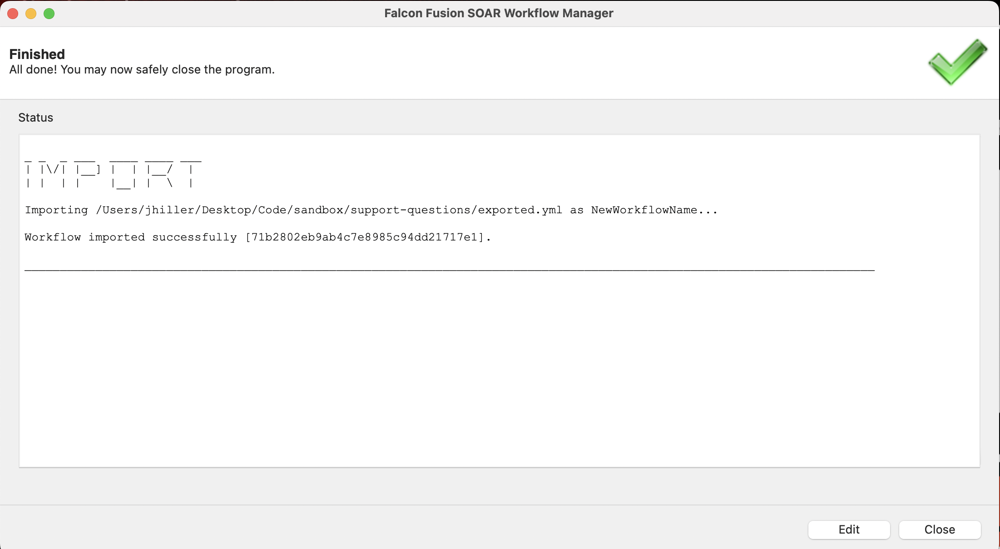

[](https://reddit.com/r/crowdstrike)

# Workflows examples
The examples within this folder focus on leveraging CrowdStrike's Falcon Falcon Fusion SOAR API.

- [Workflow Manager (terminal)](#workflow-manager-terminal-version)
- [Workflow Manager (gui)](#workflow-manager-gui-version)

## Workflow Manager (Terminal version)
This sample demonstrates how to leverage the Workflows API to provide the following functionality:

- List all workflows
- Execute a workflow
- List all executions for a workflow
- Print the results of a workflow execution
- Import a workflow
- Export a workflow

### Running the program
In order to run this demonstration, you you will need access to CrowdStrike API keys with the following scopes:

| Service Collection | Scope |
| :---- | :---- |
| Workflows | __READ__, __WRITE__ |

#### Required packages
In order to run this sample, you will need to have the [`tabulate`](https://pypi.org/project/tabulate/) and [`termcolor`](https://pypi.org/project/termcolor/) packages installed.

### Execution syntax
This sample leverages simple command-line arguments to implement functionality.

#### Basic usage
Execute the default example. This will default to listing all workflows discovered in tabular format.

```shell
python3 workflow_manager.py -k $FALCON_CLIENT_ID -s $FALCON_CLIENT_SECRET
```

> [!TIP]
> This sample supports [Environment Authentication](https://falconpy.io/Usage/Authenticating-to-the-API.html#environment-authentication), meaning you can execute any of the command lines shown below without providing credentials if you have the values `FALCON_CLIENT_ID` and `FALCON_CLIENT_SECRET` defined in your environment.

```shell
python3 workflow_manager.py
```

Change the CrowdStrike region with the `-b` argument.

```shell
python3 workflow_manager.py -b usgov1
```

Execute a workflow using a custom payload.

```shell
python3 workflow_manager.py -e -i $WORKFLOW_DEFINITION_ID -p {'key': 'value'}
```

List all executions of a workflow using the `-le` argument.

```shell
python3 workflow_manager.py -le -i $WORKFLOW_DEFINITION_ID
```

Retrieve the results of an execution with the `-g` argument.

```shell
python3 workflow_manager.py -g -i $WORKFLOW_EXECUTION_ID
```

Export a workflow to a local YAML file using the `-ex` argument.

```shell
python3 workflow_manager.py -ex $EXPORT_FILENAME -i $WORKFLOW_DEFINITION_ID
```

> [!NOTE]
> Exporting to an existing file will overwrite it's contents.

Import a workflow from a local YAML file using the `-im` argument.

```shell
python3 workflow_manager.py -im $IMPORT_FILENAME
```

> [!NOTE]
> If the workflow name defined within your workflow YAML file exists within your tenant, an error will be thrown.
> Use the `-n` argument to import this file as a new workflow with a new name.

```shell
python3 workflow_manager.py -im $IMPORT_FILENAME -n $WORKFLOW_NEW_NAME
```

> [!TIP]
> You can validate this workflow import without saving by providing the `-v` argument with the above command.

```shell
python3 workflow_manager.py -im $IMPORT_FILENAME -n $WORKFLOW_NEW_NAME -v
```

API debugging can be enabled using the `-d` argument.

```shell
python3 workflow_manager.py -d
```

Adjust the output table format using the `-t` argument.

```shell
python3 workflow_manager.py -l -t fancy_grid
```

Swap to JSON output with the `-j` argument.

```shell
python3 workflow_manager.py -l -j
```

#### Command-line help
Command-line help is available via the `-h` argument.

```shell
usage: workflow_manager.py [-h] [-d] [-i ID] [-p PAYLOAD] [-e] [-g] [-l] [-le] [-ex EXPORT_WORKFLOW] [-im IMPORT_WORKFLOW] [-n WORKFLOW_NAME] [-v] [-j] [-t TABLE_FORMAT] [-k CLIENT_ID]
                           [-s CLIENT_SECRET] [-b BASE_URL]

Falcon Fusion SOAR workflow manager.

 _______                        __ _______ __        __ __
|   _   .----.-----.--.--.--.--|  |   _   |  |_.----|__|  |--.-----.
|.  1___|   _|  _  |  |  |  |  _  |   1___|   _|   _|  |    <|  -__|
|.  |___|__| |_____|________|_____|____   |____|__| |__|__|__|_____|
|:  1   |                         |:  1   |
|::.. . |   CROWDSTRIKE FALCON    |::.. . |    FalconPy
`-------'                         `-------'

 ██       ██                 ██       ████  ██
░██      ░██                ░██      ░██░  ░██
░██   █  ░██  ██████  ██████░██  ██ ██████ ░██  ██████  ███     ██
░██  ███ ░██ ██░░░░██░░██░░█░██ ██ ░░░██░  ░██ ██░░░░██░░██  █ ░██
░██ ██░██░██░██   ░██ ░██ ░ ░████    ░██   ░██░██   ░██ ░██ ███░██
░████ ░░████░██   ░██ ░██   ░██░██   ░██   ░██░██   ░██ ░████░████
░██░   ░░░██░░██████ ░███   ░██░░██  ░██   ███░░██████  ███░ ░░░██
░░       ░░  ░░░░░░  ░░░    ░░  ░░   ░░   ░░░  ░░░░░░  ░░░    ░░░
 ████     ████
░██░██   ██░██                               █████
░██░░██ ██ ░██  ██████   ███████   ██████   ██░░░██  █████  ██████
░██ ░░███  ░██ ░░░░░░██ ░░██░░░██ ░░░░░░██ ░██  ░██ ██░░░██░░██░░█
░██  ░░█   ░██  ███████  ░██  ░██  ███████ ░░██████░███████ ░██ ░
░██   ░    ░██ ██░░░░██  ░██  ░██ ██░░░░██  ░░░░░██░██░░░░  ░██
░██        ░██░░████████ ███  ░██░░████████  █████ ░░██████░███
░░         ░░  ░░░░░░░░ ░░░   ░░  ░░░░░░░░  ░░░░░   ░░░░░░ ░░░

This sample demonstrates how to leverage the Workflows API to provide
the following functionality:
  - List all workflows                            (-l or --list-workflows)
  - Execute a workflow                            (-e or --execute)
  - List all executions for a workflow            (-le or --list-executions)
  - Print the results of a workflow execution     (-g or --get_result)
  - Import a workflow                             (-im {FILENAME} or --import-workflow {FILENAME})
  - Export a workflow                             (-ex {FILENAME} or --export-workflow {FILENAME})

Creation date: 11.06.2024 - jlangdev@CrowdStrike
Modification date: 11.08.2024 - jshcodes@CrowdStrike

This sample requires the following packages:
- crowdstrike-falconpy >= 1.4.1
- tabulate
- termcolor

options:
  -h, --help            show this help message and exit
  -d, --debug           Activate API debugging

workflow arguments:
  -i, --id ID           Workflow definition or execution ID
  -p, --payload PAYLOAD
                        Workflow execution payload

command arguments:
  -e, --execute         Execute the workflow specified
  -g, --get-result      Retrieve a workflow execution result
  -l, --list-workflows  List all workflows
  -le, --list-executions
                        List the executions for the workflow specified
  -ex, --export-workflow EXPORT_WORKFLOW
                        Export a workflow to a local file.
                        Provide a filename for this argument. Example: 'exported.yml'
  -im, --import-workflow IMPORT_WORKFLOW
                        Import a workflow from a local file.
                        Provide a filename for this argument. Example: 'to_import.yml'
  -n, --workflow-name WORKFLOW_NAME
                        Name for the imported workflow
  -v, --validate-only   Validate the workflow only, do not save upon import

formatting arguments:
  -j, --json            Display execution results in JSON format
  -t, --table-format TABLE_FORMAT
                        Tabular display format

authentication arguments (environment authentication supported):
  -k, --falcon-client-id CLIENT_ID
                        CrowdStrike Falcon API ID
  -s, --falcon-client-secret CLIENT_SECRET
                        CrowdStrike Falcon API secret
  -b, --base-url BASE_URL
                        CrowdStrike Region (US1, US2, EU1, USGOV1, USGOV2) 
                        Full URL is also supported.
```

### Example source code
The source code for this example can be found [here](workflow_manager.py).

---
---
---

<a id="workflow-manager-gui-toc"></a>

## Workflow Manager (GUI version)

[Running the program](#running-the-program-1) || [Authentication](#authentication) || [Basic Usage](#basic-usage-1) || 
[Advanced Usage](#advanced-usage) || [Command-line help](#command-line-help-1) || [Source Code](#example-source-code-1)

Like the sample above, this sample demonstrates how to leverage the Workflows API to provide the following functionality:


- List all workflows
- Execute a workflow
- List all executions for a workflow
- Print the results of a workflow execution
- Import a workflow
- Export a workflow

Additional functionality provided by this sample include:

- Full GUI interface
- Activity logging (to a local file)
- Exporting list results to CSV

### Running the program
In order to run this demonstration, you you will need access to CrowdStrike API keys with the following scopes:

| Service Collection | Scope |
| :---- | :---- |
| Workflows | __READ__, __WRITE__ |


This application can be started using a simple command line without arguments.

```shell
python3 workflow_manager_gui.py
```

#### Required packages
In order to run this sample, you will need to have the [`Gooey`](https://pypi.org/project/Gooey/), [`requests`](https://pypi.org/project/requests/) and [`tabulate`](https://pypi.org/project/tabulate/) packages installed.

[Return to Summary](#workflow-manager-gui-toc)

---
---

### Authentication


API credentials can be specified on the __Environment__ tab.

These will be pre-populated if provided by the command line or environment.

> [!TIP]
> These values can be provided on the command line using the `-k` and `-s` arguments or the `--client_id` and `--client_secret` arguments. 
> This sample also supports [Environment Authentication](https://falconpy.io/Usage/Authenticating-to-the-API.html#environment-authentication), meaning these values will be pre-populated for you from the variables `FALCON_CLIENT_ID` and `FALCON_CLIENT_SECRET` if they are present in the execution environment.

[Return to Summary](#workflow-manager-gui-toc)

---
---

### Basic Usage
The GUI workflow manager application supports all of the  same command functionality provided by the [terminal version](#workflow-manager-terminal-version).

- [Listing workflows](#listing-workflows)
- [Executing a workflow](#executing-a-workflow)
- [Retrieving workflow execution IDs](#retrieving-all-executions-for-a-workflow)
- [Getting an execution result](#getting-the-results-of-a-workflow-execution)
- [Exporting workflows](#exporting-a-workflow-to-a-yaml-file)
- [Importing workflows](#importing-a-workflow-from-a-yaml-file)

#### Listing workflows


To retrieve a list of all workflows within the tenant, select __*list_workflows*__ on the __Command__ tab.

Listing all workflows within the tenant requires no additional parameters (beyond authentication).

> [!NOTE]
> This is the default command when no command is specified.

<BR/><BR/><BR/><BR/><BR/>


Results will be shown in a console window.

> [!TIP]
> Review advanced configuration options below for more detail regarding 
> [table formatting](#formatting-output) and [outputting results to CSV](#exporting-list-results-to-csv).

<BR/><BR/><BR/><BR/><BR/>

---

#### Executing a workflow


To execute a workflow, first select the `execute` action on the __Command__ tab.

<BR/><BR/><BR/><BR/><BR/><BR/><BR/><BR/><BR/>


Provide the workflow definition ID of the workflow to execute in the __*id*__ field on the __Workflow__ tab.

<BR/><BR/><BR/><BR/><BR/><BR/><BR/><BR/>


If authentication credentials are provided via the command line or detected within the environment, the application will attempt
to display a dropdown of all available workflows.

> [!TIP]
> Bypass this behavior by providing the `-sk` or `--skip_preflight` command line argument when starting the application.

<BR/><BR/><BR/><BR/>


The dropdown is editable and will accept custom values.

<BR/><BR/><BR/><BR/><BR/><BR/><BR/><BR/><BR/>


Once your ID has been specified, provide the necessary execution payload for the workflow in the `payload` field.

<BR/><BR/><BR/><BR/><BR/><BR/><BR/><BR/><BR/>


Clicking the __*Start*__ button will execute the options specified and display the results to the console.

<BR/><BR/><BR/><BR/><BR/><BR/><BR/>

---

#### Retrieving all executions for a workflow


Select the `list_executions` option on the __Command__ tab to begin.

<BR/><BR/><BR/><BR/><BR/><BR/><BR/><BR/><BR/>


Provide the desired workflow definition ID in the __*id*__ field on the __Workflow__ tab.

<BR/><BR/><BR/><BR/><BR/><BR/><BR/><BR/><BR/>


Clicking the __*Start*__ button will execute the search. 

Results are displayed to the console.

<BR/><BR/><BR/><BR/><BR/><BR/>

---

#### Getting the results of a workflow execution


To retrieve results for a specific execution, first select the `get_result` option on the __Command__ tab.

<BR/><BR/><BR/><BR/><BR/><BR/><BR/><BR/>


Provide the Workflow execution ID in the __*execution_id*__ field on the __Workflow__ tab.

<BR/><BR/><BR/><BR/><BR/><BR/><BR/><BR/>


To return results in indented JSON format, select the __*json*__ option on the __Environment__ tab.

<BR/><BR/><BR/><BR/><BR/><BR/><BR/><BR/>


Clicking the __*Start*__ button will execute the request using the specified options and display the results to the console.

> [!NOTE]
> Device IDs were redacted for this screen shot but are typically shown by the application.

<BR/><BR/><BR/><BR/>

---

#### Exporting a workflow to a YAML file


Select the __*workflow_export*__ option on the __Command__ tab.

<BR/><BR/><BR/><BR/><BR/><BR/><BR/><BR/><BR/>


Provide the desired workflow definition ID in the __*id*__ field on the __Workflow__ tab.

<BR/><BR/><BR/><BR/><BR/><BR/><BR/><BR/><BR/>


Use the __*export_workflow*__ field on the __Export__ tab to specify the save file for the export.

<BR/><BR/><BR/><BR/><BR/><BR/><BR/><BR/>


This file will be saved in YAML format.


<BR/><BR/><BR/><BR/><BR/><BR/><BR/><BR/><BR/>


The __*Browse*__ button may be used to specify this value.

<BR/><BR/><BR/><BR/><BR/><BR/><BR/>


Clicking the __*Start*__ button will export the selected workflow to the specified file.

If this file already exists, it will be overwritten.

<BR/><BR/><BR/><BR/><BR/>

---

#### Importing a workflow from a YAML file


Select the __*workflow_import*__ option on the __Command__ tab.


<BR/><BR/><BR/><BR/><BR/><BR/><BR/><BR/><BR/><BR/>


On the __Import__ tab, provide the location of the workflow template YAML file in the __*import_workflow*__ field.

<BR/><BR/><BR/><BR/><BR/><BR/><BR/><BR/>


The __*Browse*__ button can be used to search and select the desired workflow template to import.

<BR/><BR/><BR/><BR/><BR/><BR/><BR/><BR/>


If the workflow name defined within the YAML file already exists in your tenant, an error will be thrown.

You can specify a new name for this workflow using the __*workflow_name*__ field.

<BR/><BR/><BR/><BR/><BR/>


Use the __*validate*__ checkbox to specify that this workflow will be validated for successful import, but no action will be taken.

<BR/><BR/><BR/><BR/><BR/><BR/><BR/><BR/>



Clicking the __*Start*__ button will begin the import as specified.

Results will be displayed to the console upon completion.

<BR/><BR/><BR/><BR/><BR/><BR/>

[Return to Summary](#workflow-manager-gui-toc)

---
---

### Advanced Usage


There are several advanced options that can be specified on the __Environment__ tab or via the command line.

- [Formatting](#formatting-output)
- [CSV list exports](#exporting-list-results-to-csv)
- [Prefilling configuration options](#providing-configuration-via-the-command-line)
- [Font size](#adjusting-the-console-display-font-size)
- [Autostarting](#auto-starting-execution-via-the-command-line)
- [Debugging](#debugging-api-activity)
- [Logging results](#logging-results)

#### Formatting output


Specify the __*json*__ option to output results in formatted JSON.

<BR/><BR/><BR/><BR/><BR/><BR/><BR/><BR/><BR/>


Different table formats may be selected using the __*table_format*__ dropdown.

<BR/><BR/><BR/><BR/><BR/><BR/><BR/><BR/><BR/>


Output can compressed in the console to display when running multiple executions with the __*compress_output*__ option.

<BR/><BR/><BR/><BR/><BR/><BR/><BR/>

---

#### Exporting list results to CSV


Select the _csv_ option in the __*table_format*__ dropdown field to export list results to CSV for the `list_workflows` and `list_executions` commands.

Results will be saved to _**`workflows.csv`**_ or _**`workflow_executions.csv`**_ depending on the operation selected.

Execution results are still displayed to the console using the _simple_ table format when the __*Start*__ button is pressed.

<BR/><BR/>

---

#### Providing configuration via the command line
Configuration options may be specified on the command line when starting the application. These values will be pre-populated on the
configuration form. Command line provided configuration options take precedence over values specified as defaults or detected within
the running environment.

##### Specifying the list executions command option and a workflow definition ID

```shell
python3 workflow_manager_gui.py -le -i $WORKFLOW_DEFINITION_ID
```

##### Importing a workflow using the command line

```shell
python3 workflow_manager_gui.py -im -iw $PATH_AND_FILENAME -n $NEW_WORKFLOW_NAME
```

---

#### Adjusting the console display font size

The font point size for the console display can be adjusted using a positional command line argument. This value should be an integer.

```shell
python3 workflow_manager_gui.py 10
```

> [!NOTE]
> Positional command line arguments may be mixed with named arguments.

```shell
python3 workflow_manager_gui.py 14 -i $WORKFLOW_DEFINITION_ID -p {'HostNames': ['example-hostname']} -e
```

---

#### Auto-starting execution via the command line

Execution can be triggered at runtime by providing the `go` positional argument.

```shell
python3 workflow_manager_gui.py go -ex -ew $PATH_AND_FILENAME -i $WORKFLOW_DEFINITION_ID
```

> [!NOTE]
> The font size and auto-execution positional arguments can be mixed together along with named arguments. 
> When using font size and auto-execution together, the font size should be specified first.

```shell
python3 workflow_manager_gui.py 11 go -g -ei $EXECUTION_ID
```

---

#### Debugging API activity


Select the __*debug*__ option to enable API debugging.

This will show detailed information regarding interactions performed with the CrowdStrike Falcon API,
listing endpoints used, payloads provided, and responses received.

<BR/><BR/><BR/><BR/>

---

#### Logging results


To keep a separate log file of all results produced by the application, use the __*logfile*__ field.

<BR/><BR/><BR/><BR/><BR/><BR/><BR/>


The __*Browse*__ button can be used to select the log file.

<BR/><BR/><BR/><BR/><BR/>


> [!WARNING]
> If this file exists, you may be prompted to replace the existing file.
>
> This is a known issue. Log files will not be overwritten. Instead, results will be appended to the bottom of the
> file regardless of the operating system message.

<BR/><BR/><BR/><BR/><BR/>

[Return to Summary](#workflow-manager-gui-toc)

---
---

#### Command-line help
Command-line help is available via the `-h` argument.

```shell
usage: workflow_manager_gui.py [-h] (-l | -e | -le | -g | -ex | -im) [-i ID] [-ei EXECUTION_ID] [-p PAYLOAD]
                               [-n WORKFLOW_NAME] [-v] [-iw IMPORT_WORKFLOW] [-ew EXPORT_WORKFLOW] [-k CLIENT_ID]
                               [-s CLIENT_SECRET] [-b {auto,us1,us2,eu1,usgov1,usgov2}] [-lf LOGFILE] [-d] [-o] [-sk]
                               (-j |
                                     -t {plain,simple,github,grid,simple_grid,rounded_grid,heavy_grid,mixed_grid,
                                     double_grid,fancy_grid,outline,simple_outline,rounded_outline,heavy_outline,
                                     mixed_outline,double_outline,fancy_outline,pipe,csv,orgtbl,asciidoc,jira,presto,
                                     pretty,psql,rst,mediawiki,moinmoin,youtrack,html,unsafehtml,latex,latex_raw,
                                     latex_booktabs,latex_longtable,textile,tsv})

Falcon Fusion SOAR workflow manager.

 _______                        __ _______ __        __ __
|   _   .----.-----.--.--.--.--|  |   _   |  |_.----|__|  |--.-----.
|.  1___|   _|  _  |  |  |  |  _  |   1___|   _|   _|  |    <|  -__|
|.  |___|__| |_____|________|_____|____   |____|__| |__|__|__|_____|
|:  1   |                         |:  1   |
|::.. . |   CROWDSTRIKE FALCON    |::.. . |    FalconPy 1.4.1+
`-------'                         `-------'

 ██       ██                 ██       ████  ██
░██      ░██                ░██      ░██░  ░██
░██   █  ░██  ██████  ██████░██  ██ ██████ ░██  ██████  ███     ██
░██  ███ ░██ ██░░░░██░░██░░█░██ ██ ░░░██░  ░██ ██░░░░██░░██  █ ░██
░██ ██░██░██░██   ░██ ░██ ░ ░████    ░██   ░██░██   ░██ ░██ ███░██
░████ ░░████░██   ░██ ░██   ░██░██   ░██   ░██░██   ░██ ░████░████
░██░   ░░░██░░██████ ░███   ░██░░██  ░██   ███░░██████  ███░ ░░░██
░░       ░░  ░░░░░░  ░░░    ░░  ░░   ░░   ░░░  ░░░░░░  ░░░    ░░░
 ████     ████
░██░██   ██░██                               █████
░██░░██ ██ ░██  ██████   ███████   ██████   ██░░░██  █████  ██████
░██ ░░███  ░██ ░░░░░░██ ░░██░░░██ ░░░░░░██ ░██  ░██ ██░░░██░░██░░█
░██  ░░█   ░██  ███████  ░██  ░██  ███████ ░░██████░███████ ░██ ░
░██   ░    ░██ ██░░░░██  ░██  ░██ ██░░░░██  ░░░░░██░██░░░░  ░██
░██        ░██░░████████ ███  ░██░░████████  █████ ░░██████░███
░░         ░░  ░░░░░░░░ ░░░   ░░  ░░░░░░░░  ░░░░░   ░░░░░░ ░░░

This sample demonstrates how to leverage the Workflows API to provide
the following functionality:
  - List all workflows
    - Results can be exported to CSV
  - Execute a workflow
  - List all executions for a workflow
    - Results can be exported to CSV
  - Print the results of a workflow execution
  - Import a workflow
  - Export a workflow
  - Optional logging of results to a file

This version leverages the Gooey project to implement a simple GUI, command line
arguments are supported but not required to specify execution configuration.

Creation date: 11.06.2024 - Initial version, jlangdev@CrowdStrike
Modification date: 11.08.2024 - Refactoring, jshcodes@CrowdStrike
Modification date: 11.10.2024 - Add graphical interface, jshcodes@CrowdStrike

This sample requires the following packages:
- crowdstrike-falconpy >= 1.4.1
- gooey
- requests
- tabulate

options:
  -h, --help            show this help message and exit

Command:
  Workflow command to perform

  -l, --list_workflows  List all workflows
  -e, --execute         Execute the workflow specified on the Workflow tab
  -le, --list_executions
                        List the executions for the workflow specified
  -g, --get_result      Retrieve a workflow execution result
  -ex, --workflow_export
                        Export a workflow
  -im, --workflow_import
                        Import a workflow

Workflow:
  Workflow or execution ID and workflow payload

  -i, --id ID           Workflow definition ID
  -ei, --execution_id EXECUTION_ID
                        Workflow execution ID
  -p, --payload PAYLOAD
                        Workflow execution payload

Import:
  Import a workflow from a file

  -n, --workflow_name WORKFLOW_NAME
                        Name for the imported workflow
  -v, --validate_only   Validate the workflow only, do not save upon import
  -iw, --import_workflow IMPORT_WORKFLOW
                        Location of the YAML workflow file to import

Export:
  Export a workflow to a file

  -ew, --export_workflow EXPORT_WORKFLOW
                        Location to save the exported workflow (YAML format)
                        Use the Workflow tab to specify the desired workflow ID

Environment:
  Authentication and program execution options

  -k, --client_id CLIENT_ID
                        CrowdStrike Falcon API ID
                        (pre-filled from environment or command line)
  -s, --client_secret CLIENT_SECRET
                        CrowdStrike Falcon API secret
                        (pre-filled from environment or command line)
  -b, --base_url {auto,us1,us2,eu1,usgov1,usgov2}
                        CrowdStrike Region
                        ('auto' not implemented for usgov1 or usgov2)
  -lf, --logfile LOGFILE
                        Log output results to a local file as well as the console
  -d, --debug            Activate API debugging
  -o, --compress_output
                         Compress display output
  -sk, --skip_preflight
                         Skip preflight API lookups
  -j, --json            Display execution results in JSON format
  -t, --table_format {plain,simple,github,grid,simple_grid,rounded_grid,heavy_grid,mixed_grid,double_grid,fancy_grid,outline,simple_outline,rounded_outline,heavy_outline,mixed_outline,double_outline,fancy_outline,pipe,csv,orgtbl,asciidoc,jira,presto,pretty,psql,rst,mediawiki,moinmoin,youtrack,html,unsafehtml,latex,latex_raw,latex_booktabs,latex_longtable,textile,tsv}
                        Tabular display format
                        Selecting CSV format will output to a file and display a table to the console using simple format
```

[Return to Summary](#workflow-manager-gui-toc)

---
---

### Example source code
The source code for this example can be found [here](workflow_manager_gui.py).

[Return to Summary](#workflow-manager-gui-toc)

---
---
---